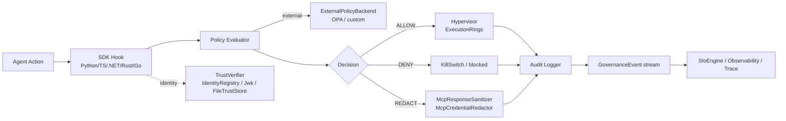

# Agent Governance Toolkit — Architectural Analysis

**Project:** [microsoft/agent-governance-toolkit](https://github.com/microsoft/agent-governance-toolkit) (local clone at `/Users/toddysm/Documents/Development/agent-governance-toolkit`)
**Version analyzed:** v3.2.2 (branch `main`)
**Analysis date:** 2026-04-26
**Analyst:** `codebase-architecture-analyst` skill
**Output base:** `/Users/toddysm/Documents/Development/software-engineering-skills-content/agent-governance-toolkit/20260426_154739/`

---

## 1. Executive Summary

The Agent Governance Toolkit (AGT) is a large, polyglot, **multi-package OSS monorepo** that provides **runtime governance for AI agents**: deterministic policy enforcement, zero-trust identity, execution sandboxing, and SRE for autonomous agent systems. It markets itself as covering all 10 OWASP Agentic risks with a 9,500+ test suite.

**Key facts (measured):**

| Metric | Value |
|---|---|
| Source files (analyzed) | **2,078** |
| Top-level files in repo (excl. `.git/`) | 3,456 |
| Repo size on disk | 67 MB |
| Languages (by file count) | Python 1,595 · TypeScript 262 · C# 74 · TSX 49 · Rust 39 · Go 33 · JS 14 · Kotlin 12 |
| Lines of code (Python alone) | ≈429,000 |
| Total LOC across analyzed files | ≈530,000 |
| Top-level packages directories | 11 in `packages/` plus 5 standalone language SDKs |
| Build/manifest variety | `pyproject.toml`, `requirements*.txt`, `package.json`, `Cargo.toml`, `go.mod`, `*.csproj`, Helm charts, Dockerfiles, mkdocs |

**Architectural shape:** A *governance plane* implemented as language-native SDKs (`agent-governance-python`, `-dotnet`, `-golang`, `-rust`, `-typescript`) sitting on top of a Python-heavy *runtime layer* under `packages/` (`agent-os`, `agent-mesh`, `agent-runtime`, `agent-hypervisor`, `agent-sre`, `agent-compliance`, `agent-discovery`, etc.), plus a marketplace, demos, examples, fuzz harnesses, and CI/release pipelines.

**Architectural strengths:**
- Clear separation between **policy decision** (PolicyEvaluator / PolicyDocument), **policy enforcement** (Hypervisor / KillSwitch / ExecutionRings), **identity & trust** (TrustVerifier / IdentityRegistry / FileTrustStore), **observability** (audit, telemetry, SLO engine), and **integrations** (`packages/agentmesh-integrations/*` — 20+ third-party adapters).
- Polyglot consistency: each language SDK mirrors the same subsystem names (Policy, Trust, Mcp, Audit, Hypervisor, Sre).
- First-class MCP (Model Context Protocol) support: `McpGateway`, `McpSecurityScanner`, `McpCredentialRedactor`, `McpResponseSanitizer`.

**Architectural concerns:**
- Heavy structural coupling around shared utilities — `packages/agent-os` is referenced by most other packages and has its own `modules/` sub-tree (atr, amb, cmvk, scak, control-plane, observability, mute-agent, emk, …).
- Some files flagged for **multiple-responsibility risk** (single-responsibility score < 0.5 on a non-trivial number of files according to the file inventory).
- "Standalone language directories" (`agent-governance-*`) coexist with legacy paths under `packages/`; `AGENTS.md` explicitly notes this is a transitional state.

**Security posture (preview — full detail in [security/detailed-security-analysis.md](security/detailed-security-analysis.md)):**
- **0 HIGH severity bandit findings**, 66 MEDIUM/HIGH-confidence Python static-analysis findings (mostly hardcoded `0.0.0.0` binds in examples, insecure `/tmp` paths, and unpinned HuggingFace downloads).
- **9 MEDIUM dependency CVEs** — all in two packages (`pypdf` 6.7.5 in `caas` module; `streamlit` 1.41.0 in `scak` module). No CRITICAL/HIGH dependency CVEs.
- **127 detect-secrets findings across 80 files** — most are inside test fixtures, redactor test inputs, and Jupyter HTML traces; only ~45 non-test files require manual review and the majority appear to be example/demo placeholders.
- **46 HIGH severity IaC misconfigurations** in Trivy: Dockerfiles running as `root` and Kubernetes manifests with `readOnlyRootFilesystem=false` and missing securityContext.

---

## 2. Repository Layout

```
agent-governance-toolkit/
├── agent-governance-python/      # Canonical Python SDK home (per AGENTS.md routing)
│   ├── agent-mcp-governance/
│   └── agent-primitives/
├── agent-governance-dotnet/      # .NET SDK (canonical .NET home)
│   ├── src/AgentGovernance/                              # Core C# library
│   │   ├── Policy/         (Policy, PolicyDecision, ConflictResolution, ExternalPolicyBackend)
│   │   ├── Trust/          (TrustVerifier, IdentityRegistry, FileTrustStore, Jwk)
│   │   ├── Discovery/      (ConfigScanner, ProcessScanner, RiskScorer, AgentInventory)
│   │   ├── Mcp/            (McpGateway, McpSecurityScanner, McpCredentialRedactor)
│   │   ├── Hypervisor/     (KillSwitch, ExecutionRings)
│   │   ├── Sre/            (SloEngine)
│   │   ├── Audit/          (AuditLogger, GovernanceEvent)
│   │   └── Security/       (PromptInjectionDetector, PromptDefenseEvaluator)
│   ├── src/AgentGovernance.Extensions.ModelContextProtocol/
│   └── src/AgentGovernance.Extensions.Microsoft.Agents/
├── agent-governance-golang/      # Go SDK (packages/agentmesh, packages/agentmesh-mcp)
├── agent-governance-rust/        # Rust crates (agentmesh, agentmesh-mcp)
├── agent-governance-typescript/  # TS SDK
├── packages/                     # Python runtime + product code (1,812 files)
│   ├── agent-os/                       # Largest subsystem (modules/, services/, charts/, …)
│   ├── agent-mesh/                     # Inter-agent identity & messaging
│   ├── agent-runtime/                  # Runtime adapters (deploy.py, …)
│   ├── agent-hypervisor/               # Sandboxing & execution rings
│   ├── agent-sre/                      # SRE primitives (SBOM, SLOs, observability)
│   ├── agent-compliance/               # Compliance scanners
│   ├── agent-discovery/                # Process/config scanners (Python parallel of .NET Discovery)
│   ├── agent-marketplace/
│   ├── agent-lightning/
│   ├── agent-os-vscode/                # VS Code extension (TS)
│   └── agentmesh-integrations/         # 20+ third-party adapters (langchain, llamaindex, crewai, openai-agents, langgraph, haystack, pydantic-ai, mcp-trust-proxy, a2a-protocol, …)
├── examples/                     # maf-integration/* (loan, healthcare, helpdesk, devops, customer-service), openai-agents-governed, crewai-governed, …
├── demo/                         # governance-dashboard (Streamlit), maf-integration walkthroughs
├── benchmarks/                   # Performance/red-team benchmarks
├── fuzz/                         # ClusterFuzzLite harnesses
├── notebooks/                    # Jupyter notebooks (mute-agent traces, …)
├── docs/                         # mkdocs site, ADRs, tutorials, OWASP-COMPLIANCE
├── pipelines/                    # Azure DevOps ESRP release pipelines
├── ci/                           # CI helpers
├── action/                       # GitHub Action wrapper
├── releases/                     # Release artifacts
├── scripts/                      # Repo-level scripts
├── docker-compose.yml            # Top-level compose
├── Dockerfile                    # Top-level image
└── mkdocs.yml
```

**Routing rule** (from `AGENTS.md`): when a standalone `agent-governance-<lang>/` directory exists, treat it as the canonical home for that language. `packages/` continues to host runtime/product code that has not migrated.

---

## 3. Architecture Overview

The toolkit implements a **policy-decision / policy-enforcement** split with the following logical subsystems:

### 3.1 Subsystem Map

| Subsystem | Responsibility | Representative paths |
|---|---|---|
| **Policy** | Evaluate `(action, context) → ALLOW/DENY/REDACT` deterministically with conflict resolution and external backend support | `agent-governance-dotnet/.../Policy/*`, `packages/agent-mesh/src/agentmesh/governance/policy_evaluator.py` |
| **Trust & Identity** | Cryptographic identity, JWKS, trust store, federation | `agent-governance-dotnet/.../Trust/*`, `packages/agent-mesh/src/agentmesh/identity/*`, `agent-governance-rust/agentmesh/src/audit.rs` |
| **Hypervisor** | Process supervisor, KillSwitch, execution rings (privilege tiers) | `agent-governance-dotnet/.../Hypervisor/*`, `packages/agent-hypervisor/` |
| **Discovery** | Inventory agents from process/config scans, score risk | `agent-governance-dotnet/.../Discovery/*`, `packages/agent-discovery/` |
| **MCP Gateway** | Proxy / sanitize / redact MCP tool calls and responses | `agent-governance-dotnet/.../Mcp/*`, `packages/agent-mesh/src/agentmesh/integrations/mcp/*`, `packages/agentmesh-integrations/mcp-trust-proxy/`, `agent-governance-rust/agentmesh-mcp/` |
| **Audit & Observability** | Append-only audit log, governance events, telemetry, SLO engine | `agent-governance-dotnet/.../Audit/*`, `packages/agent-os/modules/observability/`, `packages/agent-sre/` |
| **Security primitives** | Prompt-injection detection, prompt-defense evaluator | `agent-governance-dotnet/.../Security/*` |
| **Compliance** | SBOM, security scanners, evidence packaging | `packages/agent-compliance/`, `packages/agent-sre/src/agent_sre/sbom.py` |
| **Integrations** | Third-party agent framework adapters | `packages/agentmesh-integrations/*` (langchain, crewai, llamaindex, openai-agents, pydantic-ai, haystack, …) |
| **Demo / Examples / Notebooks** | End-user flows (Streamlit dashboard, MAF demos, helpdesk/healthcare/loan/devops) | `demo/`, `examples/`, `notebooks/` |

### 3.2 Data-flow (single-action evaluation)



### 3.3 Component coupling — central modules

The deep dependency analyzer recorded **1,426 graph nodes / 2,229 import edges** (see [dependencies/dependency-graph.json](dependencies/dependency-graph.json) and the interactive HTML at [dependencies/dependency-graph.html](dependencies/dependency-graph.html)).

**0 circular dependencies** were detected at the module level.

The most-imported *internal* hubs (after stripping stdlib/test framework imports) are concentrated in:

- `packages/agent-os/src/agent_os/...` (kernel, stateless runtime, observability)
- `packages/agent-mesh/src/agentmesh/identity/`
- `packages/agent-mesh/src/agentmesh/governance/policy_evaluator.py`
- `agent-governance-dotnet/src/AgentGovernance/GovernanceKernel.cs` (cross-cutting in the .NET SDK)

Large external dependency surface is dominated by `pytest` (211 importers, all tests), `os` / `sys` / `json` / `asyncio` / `time` (typical), plus `Xunit` (.NET), `react`, `serde`, `serde_json`, `tokio`-style async patterns in Rust.

### 3.4 Polyglot symmetry

Each language SDK exposes parallel concepts:

| Concept | Python (`packages/`) | .NET (`AgentGovernance`) | Rust (`agentmesh`) | TypeScript | Go (`agentmesh`) |
|---|---|---|---|---|---|
| Policy evaluator | `policy_evaluator.py` | `Policy/Policy.cs` | `governance/` | `PolicyEngine` | `policy/` |
| Trust verifier | `identity/*` | `Trust/TrustVerifier.cs` | `audit.rs`, identity crate | n/a (consumer) | `identity.go` |
| MCP gateway | `integrations/mcp/*` | `Mcp/McpGateway.cs` | `agentmesh-mcp/src/mcp/*` | `mcp/*` | `mcp/` |
| Audit | `audit/*` | `Audit/AuditLogger.cs` | `audit.rs` | logging | `audit/` |
| Redaction | `mcp_response_scanner` | `McpCredentialRedactor.cs` | `mcp/redactor.rs` | `mcp/` | n/a |

This mirroring is the project's strongest design property — and also the strongest argument that the runtime is intended to be *deterministic and language-agnostic*.

---

## 4. Technology Stack

| Layer | Technology |
|---|---|
| **Languages** | Python 3.x (primary), TypeScript / TSX, C# / .NET, Rust, Go, Kotlin (limited) |
| **Python build** | `pyproject.toml` (across 20+ integration packages), `requirements*.txt` files, `pip` |
| **Node build** | `package.json`, `npm`, `eslint`, `jest`, `tsconfig.json` |
| **.NET** | `AgentGovernance.sln`, `Directory.Build.props/targets`, NuGet, Microsoft.Extensions.AI, MEAI |
| **Rust** | Cargo workspace (`Cargo.toml`, `Cargo.lock`), `serde`, `serde_json`, `tokio` patterns |
| **Go** | `go.mod` / `go.sum`, custom `agentmesh` packages |
| **Container** | Multiple `Dockerfile`s, top-level `docker-compose.yml`, Helm charts under `packages/agent-os/charts/` and `packages/agent-sre/charts/` |
| **CI/Release** | GitHub Actions (`.github/workflows/ci.yml`), Azure DevOps ESRP pipelines under `pipelines/`, OpenSSF Scorecard, ClusterFuzzLite (`.clusterfuzzlite/`, `fuzz/`) |
| **Docs** | `mkdocs.yml`, ADRs under `docs/adr/`, multi-language i18n (`docs/i18n/`) |
| **Demo runtime** | Streamlit (governance-dashboard), Plotly, Pandas |
| **Governance integrations** | LangChain, LangGraph, LlamaIndex, CrewAI, Microsoft Agent Framework (MAF), OpenAI Agents, Pydantic AI, Haystack, Google ADK, A2A protocol |

---

## 5. Generated Artifacts (this analysis)

| Artifact | Path |
|---|---|
| File inventory (every source file with purpose, exports, classes, complexity) | [source-files/file-inventory.json](source-files/file-inventory.json) (15 MB) |
| Per-file analyses | [source-files/file-analysis/](source-files/file-analysis/) (2,080 JSON files) |
| Documentation map | [source-files/documentation-map.json](source-files/documentation-map.json) |
| Function catalog | [source-files/function-catalog.json](source-files/function-catalog.json) |
| Dependency graph (raw) | [dependencies/dependency-graph.json](dependencies/dependency-graph.json) |
| Function dependencies | [dependencies/function-dependencies.json](dependencies/function-dependencies.json) (11 MB) |
| Impact analysis | [dependencies/impact-analysis.json](dependencies/impact-analysis.json) |
| Circular dependencies | [dependencies/circular-dependencies.json](dependencies/circular-dependencies.json) (none found) |
| **Interactive dependency graph (open in browser)** | [dependencies/dependency-graph.html](dependencies/dependency-graph.html) |
| Architecture overview (auto-generated) | [analysis/architecture-overview.md](analysis/architecture-overview.md) |
| Components guide (auto-generated) | [analysis/components-guide.md](analysis/components-guide.md) |
| Security overview (auto-generated, pattern-level) | [analysis/security-overview.md](analysis/security-overview.md) |
| Technology decisions (auto-generated) | [analysis/technology-decisions.md](analysis/technology-decisions.md) |
| **Detailed security analysis** | [security/detailed-security-analysis.md](security/detailed-security-analysis.md) |
| Vulnerability report (machine-readable) | [security/vulnerability-report.json](security/vulnerability-report.json) |
| Remediation guide | [security/remediation-guide.md](security/remediation-guide.md) |
| Attack surface map | [security/attack-surface-map.md](security/attack-surface-map.md) |
| Dependency audit | [security/dependency-audit.md](security/dependency-audit.md) |
| Tool raw output | [security/tool-scan-results/](security/tool-scan-results/) |

---

## 6. Notable Observations

1. **Trust-store on local filesystem.** `FileTrustStore.cs` and equivalent Python paths persist trust material on disk. Filesystem permissions are the only protection — no platform keystore (Keychain / DPAPI / TPM) integration is visible in the source tree. Worth confirming the deployment guidance.
2. **The redactor is a security-critical component but also a frequent secret-detector trigger.** `agent-governance-rust/agentmesh-mcp/src/mcp/redactor.rs` and `packages/agent-os/...test_credential_redactor.py` legitimately contain placeholder secret patterns; these account for many of the detect-secrets findings.
3. **Policy backends are pluggable.** `ExternalPolicyBackend.cs` plus `Policy/ConflictResolution.cs` indicate OPA / external rego is supported. Consumers should verify the external backend's TLS and auth configuration.
4. **No HIGH severity bandit findings across 217k Python LOC** is unusually clean for a project of this size; 96 of the LOW findings are `B101: assert_used` in tests (ignorable).
5. **The single SQL-injection bandit finding** (`B608`) is in a *demo* file (`packages/agent-os/modules/emk/examples/memory_features_demo.py`) — confirms it is not a production code path.
6. **HuggingFace downloads without revision pinning** (`B615`, 4 occurrences in `amb/`, `atr/`, and `control-plane/` modules) is a real supply-chain concern in production paths and should be remediated.
7. **Container hardening gap.** 16 Dockerfiles run as `root`; 9 K8s deployments lack `readOnlyRootFilesystem` and proper securityContext. These are the highest-volume HIGH-severity findings from Trivy.

---

## 7. Recommended Follow-up Queries

The dependency database supports interactive querying. See [interactive/query-examples.md](interactive/query-examples.md) for the full list. High-value examples for this codebase:

- *"What depends on `packages/agent-mesh/src/agentmesh/governance/policy_evaluator.py`?"* — to gauge blast radius before changing the policy evaluator.
- *"What does `agent-governance-dotnet/src/AgentGovernance/GovernanceKernel.cs` depend on?"* — central .NET kernel.
- *"Show me all files importing `subprocess`"* — pre-staged on the bandit `B603` findings (32 hits).
- *"What does the McpGateway depend on?"* — surface area of the MCP proxy.

Run the query engine against this analysis directory:

```sh
.venv/bin/python3 .github/skills/codebase-architecture-analyst/scripts/dependency_query_engine.py \
  /Users/toddysm/Documents/Development/software-engineering-skills-content/agent-governance-toolkit/20260426_154739 \
  --interactive
```

---

*End of master document. See sibling files for the detailed security analysis, attack-surface map, dependency audit, and component guide.*
