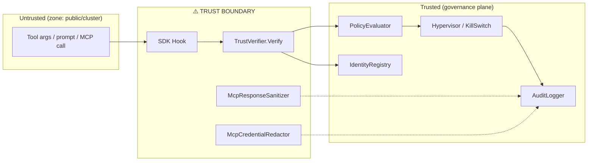

# Attack Surface Map — Agent Governance Toolkit

This document enumerates every external input point exposed by the Agent Governance Toolkit and assigns each a trust level and blast radius. It is the input to threat modelling and red-team exercises.

---

## 1. Trust zones

| Zone | Description | Default trust |
|---|---|---|
| **Public network** | The open internet | None |
| **Cluster network** | Kubernetes pod-to-pod / docker-compose links | Limited (network policy enforced) |
| **Agent runtime** | The process that hosts an AI agent + AGT SDK hooks | Caller-defined |
| **Governance plane** | Policy evaluator, audit logger, trust store | Trusted root |
| **External policy backend** | Optional OPA / custom service | Configurable; should be mTLS |

---

## 2. Entry points

### 2.1 SDK call sites (in-process, language-native)

These are the *programmatic* entry points the runtime exposes to the host application. Untrusted input can reach them via the agent's tool-call argument, prompt, or upstream message bus.

| Component | Inputs | Trust | Blast radius if exploited |
|---|---|---|---|
| `PolicyEvaluator.evaluate(context)` (Python) / `Policy.Decide(context)` (.NET) | tool name, tool args, agent identity, target resource | Caller-supplied; MUST be authenticated upstream | Bypass policy → unauthorised tool execution |
| `TrustVerifier.Verify(token)` | JWT / signed envelope | Untrusted | Identity spoofing → policy bypass |
| `IdentityRegistry.LookupOrAdd(identity)` | identity descriptor | Caller-supplied | Registry poisoning |
| `McpGateway.Forward(call)` | full MCP request including server name + tool name + arguments | Untrusted | Tool-call smuggling, command injection at the downstream MCP server |
| `McpResponseSanitizer.Sanitize(response)` | MCP tool response (potentially untrusted) | Untrusted | If sanitizer fails → leakage of model-reachable secrets |
| `McpCredentialRedactor.Redact(text)` | arbitrary text (logs, traces) | Untrusted | Failure to redact → secrets in logs |
| `KillSwitch.Trigger(reason)` | caller assertion | Trusted (governance plane only) | Denial-of-service if abused |
| `ExecutionRings.Enter(ring, fn)` | ring number | Trusted | Privilege escalation if validation skipped |
| `AuditLogger.Append(event)` | governance event | Trusted (in-process call) | Log-injection / tampering |

### 2.2 Network-facing services

| Service | Default port / address | Auth | Blast radius |
|---|---|---|---|
| `agent-mesh.integrations.mcp` (`__init__.py:424`) | currently `0.0.0.0:<port>` | depends on caller config | Direct exposure to cluster network — recommend default `127.0.0.1` (see VULN-008) |
| `demo/governance-dashboard/app.py` (Streamlit) | `0.0.0.0:8501` (compose) | None | Information disclosure if exposed to internet |
| `packages/agent-mesh/examples/docker-compose/app/server.py:43` | `0.0.0.0:<port>` | demo only | None in prod |
| `packages/agent-hypervisor/examples/docker-compose/app/dashboard.py:116` | `0.0.0.0:<port>` | demo only | None in prod |
| `packages/agent-os/services/cloud-board/` | container service | configurable | depends on deployment |
| `agent-os/extensions/mcp-server/` | MCP server | configurable | full MCP attack surface |
| `agent-os-vscode` | VS Code extension command surface | local user only | local privilege escalation if VS Code already trusted |
| `packages/agentmesh-integrations/mcp-trust-proxy/` | MCP proxy | configurable | full MCP attack surface |

### 2.3 Filesystem inputs

| Path / pattern | Trust | Notes |
|---|---|---|
| `FileTrustStore` storage location | Trusted (assumed); protected by FS ACL only | See VULN-010 — recommend platform keystore alternative |
| Audit log directory | Trusted | Append-only; ensure `O_APPEND` + filesystem-level protections |
| Config files (`.yml`, `.json` policies) | Trusted (operator-controlled) | Validate schema; reject unknown keys |
| `~/.cache/huggingface/...` | Trusted-on-write | But contents come from network — see VULN-001 |
| `/tmp/agent_*` patterns | Untrusted-shared | See VULN-007 |

### 2.4 Process / OS inputs

| Component | Mechanism | Trust |
|---|---|---|
| `agent-discovery/scanners/process.py` | reads `/proc`, runs `ps`, `lsof` | Reads untrusted process list — must defend against injection in process names/args |
| `agent-compliance/security/scanner.py` | invokes external SAST tools (bandit, semgrep, …) via `subprocess` | Tool inputs are caller-supplied paths — must validate path is within allowed root |
| Hypervisor sandboxing | spawns sandboxed subprocess for agent execution | Boundary is critical — review per language SDK |

### 2.5 External services / network calls

| Component | Endpoint | Auth | Risk |
|---|---|---|---|
| `ExternalPolicyBackend` (`.cs`) | configurable URL | configurable | Must enforce TLS + caller cert; fail-closed on unreachable backend |
| HuggingFace Hub downloads | `huggingface.co` | optional HF token | See VULN-001 (revision pinning) |
| Anthropic / OpenAI verifiers (`packages/agent-os/modules/cmvk/...`) | provider APIs | API key | Standard third-party trust |
| `packages/agent-os-vscode` GitHub integration | GitHub API | OAuth token | Token storage location matters |

---

## 3. Trust boundaries (where validation must happen)

**Validation requirements at each boundary:**

| Boundary | Required validation |
|---|---|
| SDK Hook → TrustVerifier | JWT signature, exp, iss, aud, alg pinning |
| TrustVerifier → PolicyEvaluator | identity must be in `IdentityRegistry`; namespace match |
| PolicyEvaluator → Hypervisor | decision is canonicalised; no caller field overrides decision |
| Hypervisor → AuditLogger | append-only path; no caller-controlled fields in audit envelope |
| McpGateway → downstream MCP | tool name allow-list; argument schema validation |
| McpResponseSanitizer → caller | output strictly typed; no passthrough of unknown fields |

---

## 4. High-value assets ranked

1. **Audit log integrity** — if the audit chain breaks, all governance claims become unverifiable.
2. **Trust store private keys / JWKS** — compromise = full identity spoofing.
3. **Policy documents** — compromise = arbitrary action authorisation.
4. **MCP gateway** — pivot point to downstream tools (filesystem, shell, browser, code execution).
5. **External policy backend connectivity** — failure mode must be fail-closed, not fail-open.

---

## 5. Recommended defensive controls (status)

| Control | Status |
|---|---|
| Deterministic policy evaluation (no LLM in decision path) | ✅ implemented |
| Append-only audit logging | ✅ implemented |
| Signed agent identities | ✅ implemented |
| MCP response sanitization + credential redaction | ✅ implemented |
| Hypervisor execution rings | ✅ implemented |
| Container non-root user | ❌ **missing in 16 Dockerfiles** (VULN-002) |
| K8s securityContext hardening | ❌ **missing in flagged Helm charts** (VULN-003) |
| Pinned model artifacts | ❌ **missing in 4 sites** (VULN-001) |
| Platform-keystore trust store | ❌ **only file-based shipped** (VULN-010) |
| CI dependency vulnerability gate | ⚠️ **partial** (Scorecard yes; per-language deps not all gated) |
| CI SAST gate for HIGH findings | ⚠️ **partial** (recommend semgrep + trivy in CI) |

---

*End of attack-surface map.*
