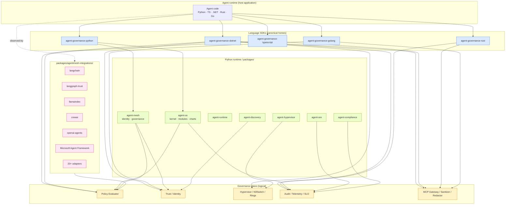
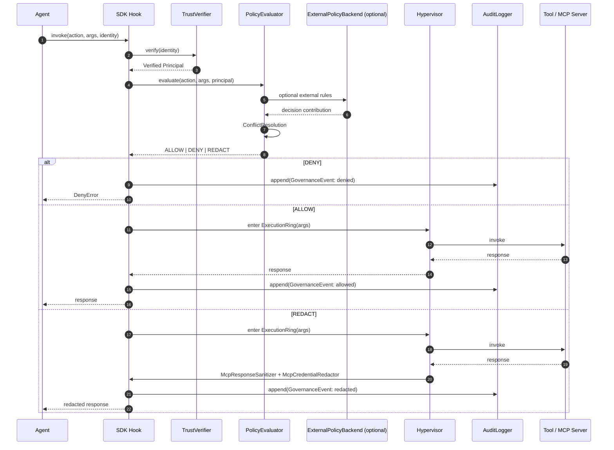
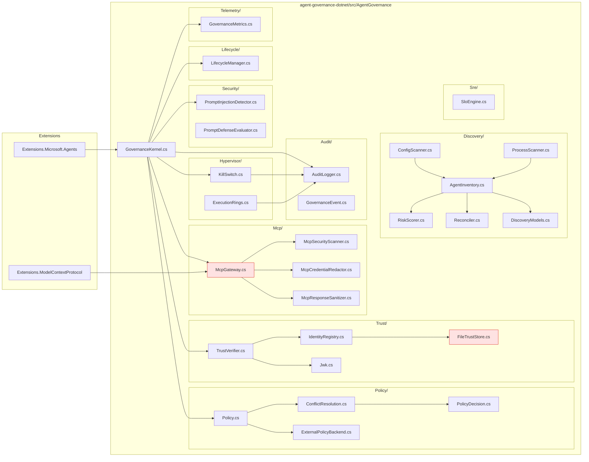
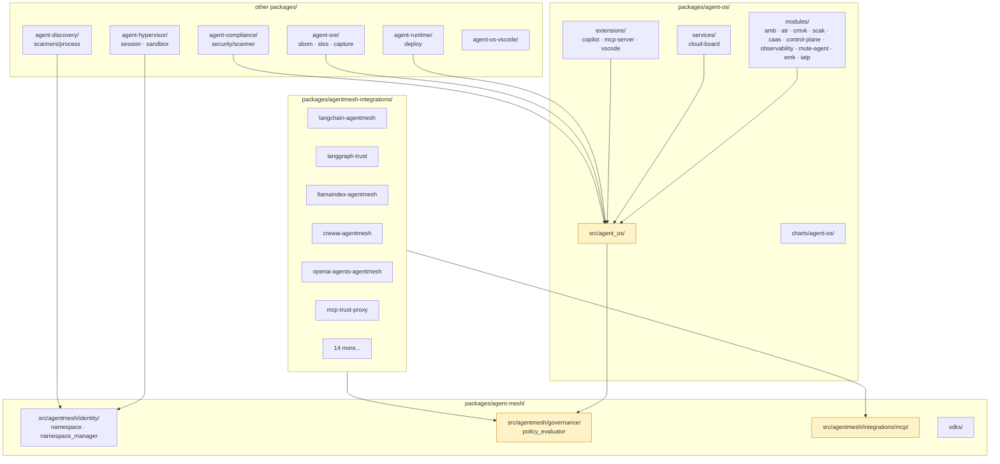
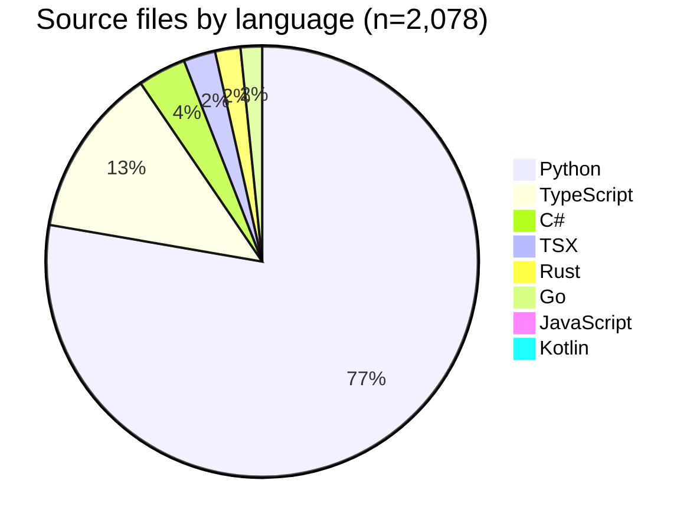
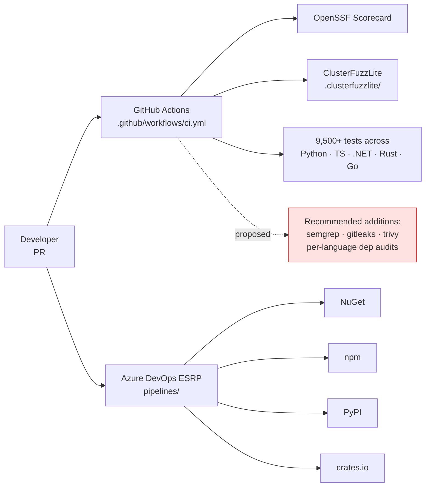

# Detailed Architecture Diagrams — Agent Governance Toolkit

These diagrams complement [../documentation.md](../documentation.md) §3 with progressively more detailed views of the system.

---

## 1. High-level subsystem map

---

## 2. Policy decision flow

---

## 3. .NET subsystem detail (canonical reference for cross-language SDKs)

`FileTrustStore.cs` and `McpGateway.cs` are highlighted (red) because they sit at the trust boundary and are the highest-value review targets.

---

## 4. Python runtime layer (`packages/`)

The yellow-highlighted nodes are the runtime layer's structural hubs.

---

## 5. Repository at-a-glance (file count by language)

---

## 6. CI / release pipeline (observed)

---

*End of detailed architecture diagrams. The interactive force-directed graph is at [../dependencies/dependency-graph.html](../dependencies/dependency-graph.html).*
