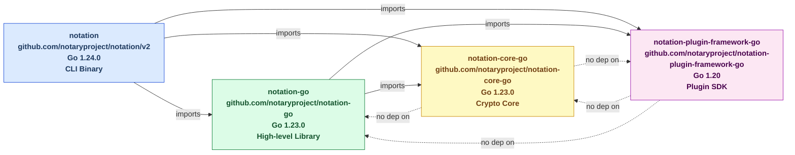
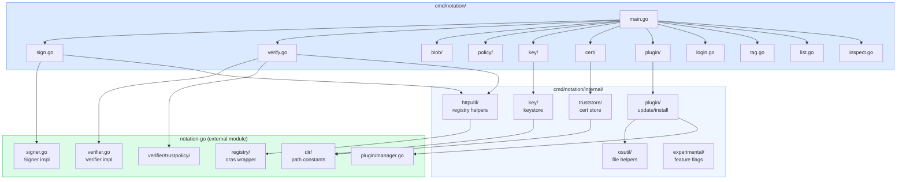
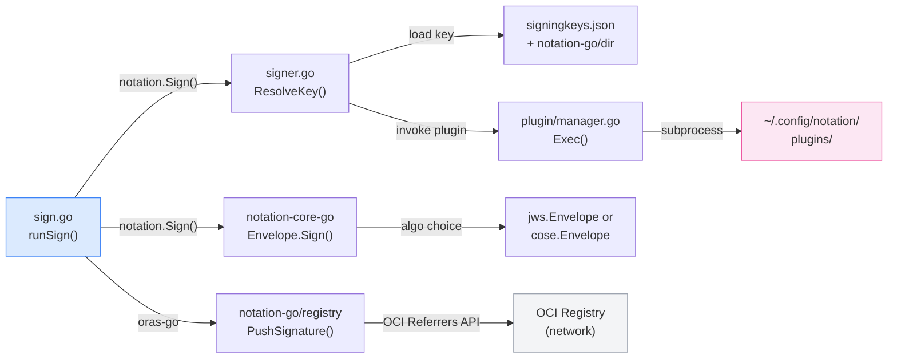

# Dependency Graphs — Notation Project

**Generated**: 2026-03-12
All diagrams use Mermaid syntax.

---

## Graph 1: Repository-Level Dependency Graph

---

## Graph 2: Key Package-Level Dependencies (Main Module)

---

## Graph 3: Critical Path for Signing

---

## Graph 4: Critical Path for Verification

```mermaid
graph LR
    VERIFY_CMD2["verify.go\nrunVerify()"] -->|"load policy"| TRUST_POL2["notation-go/verifier\ntrust policy parse + validate"]
    VERIFY_CMD2 -->|"notation.Verify()"| VERIFIER_IMPL2["notation-go\nverifier.Verify()"]

    VERIFIER_IMPL2 -->|"fetch signatures"| REG_LIST["registry/oras.go\nListSignatures()"]
    REG_LIST -->|"OCI Referrers API"| OCI_REG3["OCI Registry\n(network)"]
    OCI_REG3 -->|"sig manifest"| SIG_FETCH["registry/oras.go\nFetchSignatureBlob()"]
    SIG_FETCH --> ENVELOPE_PARSE["notation-core-go\nEnvelope.Verify()"]
    ENVELOPE_PARSE --> X509_CHK["x509/\nVerifier.Verify()\ncert chain check"]
    X509_CHK --> TRUST_POL2

    TRUST_POL2 -->|"trusted identities"| DN_MATCH["trustpolicy\nDN matching\n(go-ldap/v3)"]
    DN_MATCH -->|"allow/deny"| OUTCOME["VerificationOutcome\n{ success, signerInfo }"]

    style VERIFY_CMD2 fill:#dcfce7,stroke:#22c55e
    style OCI_REG3 fill:#f3f4f6,stroke:#9ca3af
    style OUTCOME fill:#fef9c3,stroke:#eab308
```

---

## Graph 5: External Dependency Web (Third-Party Packages)

```mermaid
graph TB
    subgraph NOTCORE2["notation-core-go"]
        C_JWT["golang-jwt/jwt/v4\nJWS envelope parsing"]
        C_COSE["veraison/go-cose\nCOSE envelope"]
        C_CBOR["fxamacker/cbor/v2\nCBOR encoding"]
        C_CRYPTO["golang.org/x/crypto\nextended crypto"]
        C_TSP_CORE["notaryproject/tspclient-go\nRFC 3161"]
    end

    subgraph NOTGO2["notation-go"]
        G_ORAS["oras.land/oras-go/v2\nOCI client"]
        G_OCI_SPEC["opencontainers/image-spec\nOCI types"]
        G_LDAP["go-ldap/ldap/v3\nDN parsing"]
        G_TSP["notaryproject/tspclient-go\nRFC 3161"]
    end

    subgraph MAINREPO["notation main"]
        M_COBRA["spf13/cobra\nCLI framework"]
        M_LOGRUS["sirupsen/logrus\nlogging"]
        M_TERM["golang.org/x/term\nterminal control"]
    end

    C_JWT --> JWS_ENVELOPE["JWS envelope\nconstruction/parsing"]
    C_COSE --> COSE_ENVELOPE["COSE envelope\nconstruction/parsing"]
    C_CBOR --> COSE_ENVELOPE
    C_CRYPTO --> COSE_ENVELOPE
    C_TSP_CORE --> TIMESTAMP["RFC 3161\nTimestamping"]
    G_TSP --> TIMESTAMP
    G_ORAS --> OCI_OPS["OCI registry\noperations"]
    G_OCI_SPEC --> OCI_OPS
    G_LDAP --> DN_PARSE["Distinguished Name\nparsing"]
    M_COBRA --> CLI_FRAMEWORK["CLI command\nstructure"]
    M_LOGRUS --> CONTEXT_LOG["Context-based\nlogging"]
    M_TERM --> TERMINAL_IO["Terminal\npassword input"]
```

