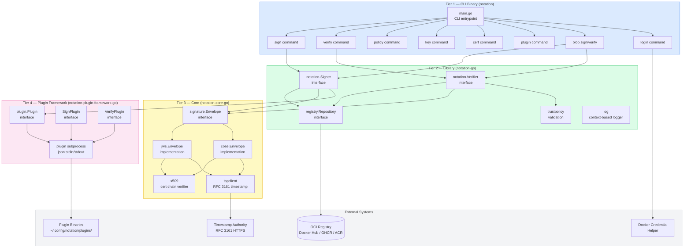
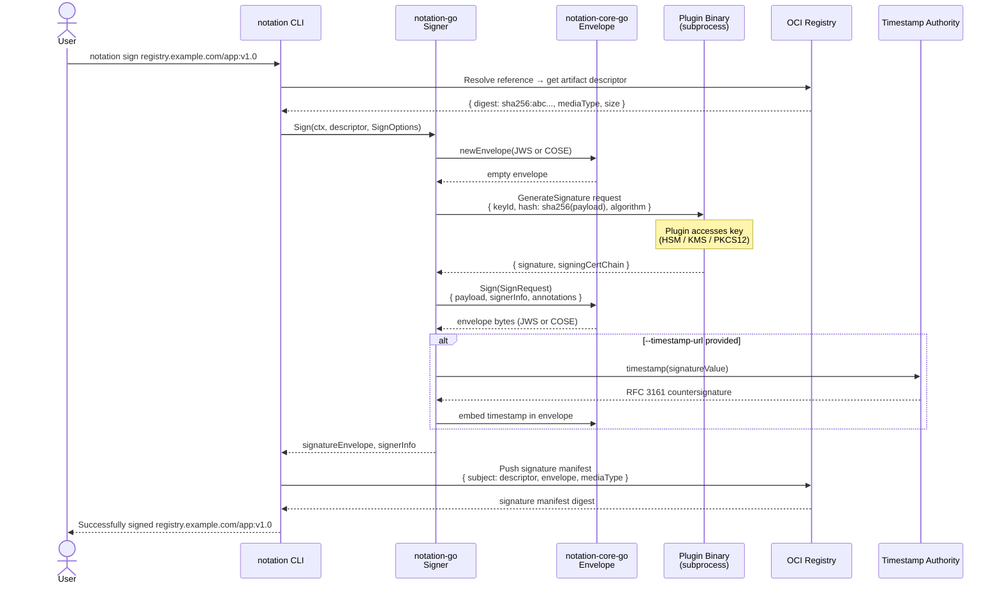
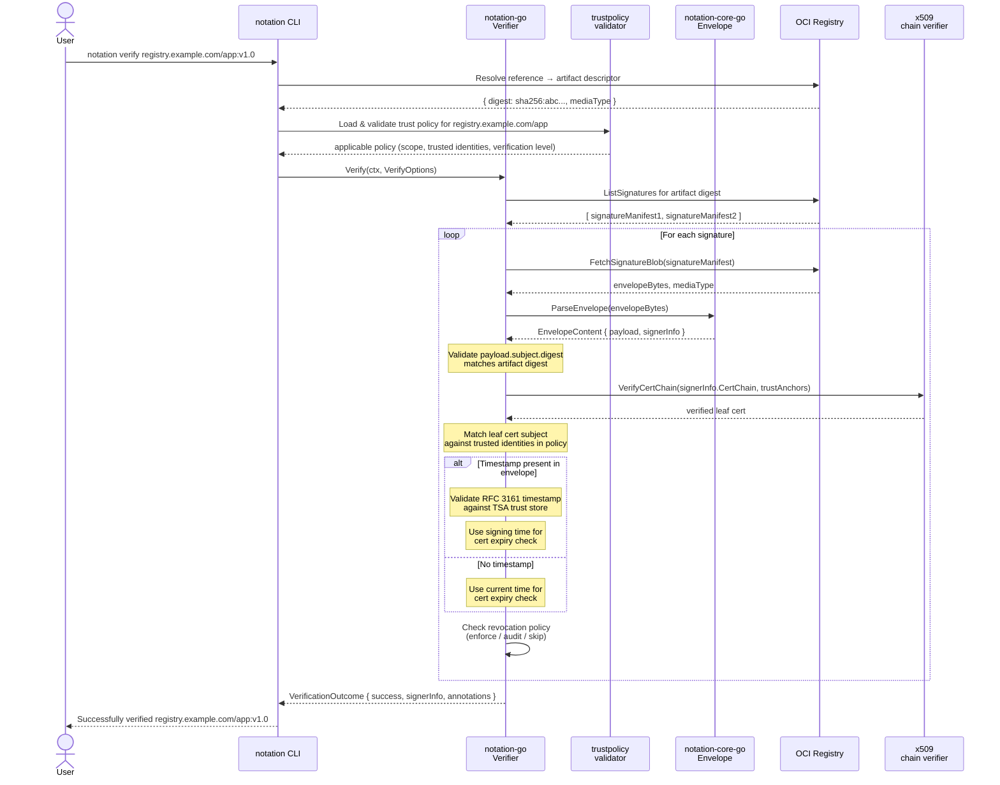
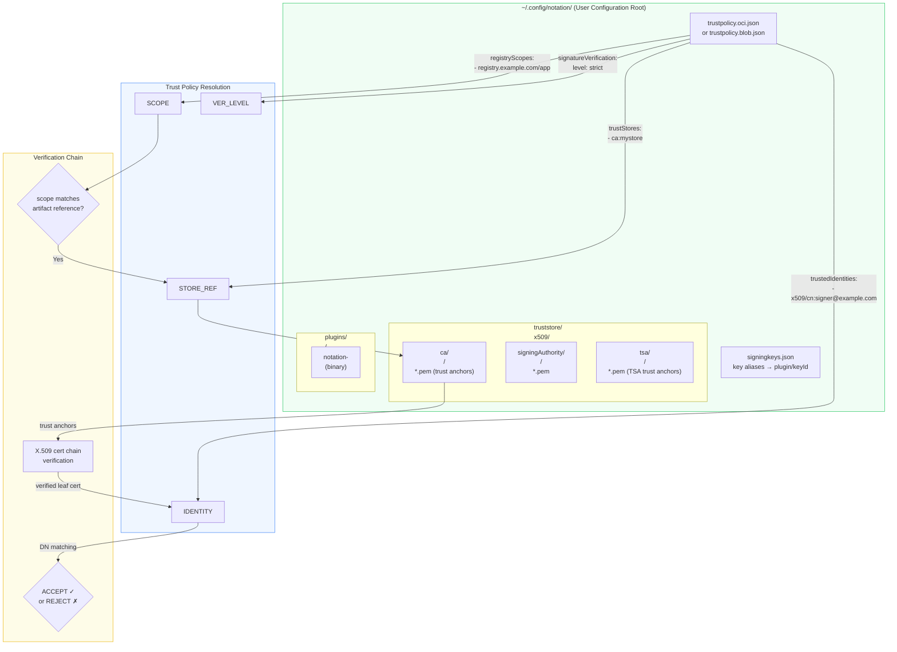
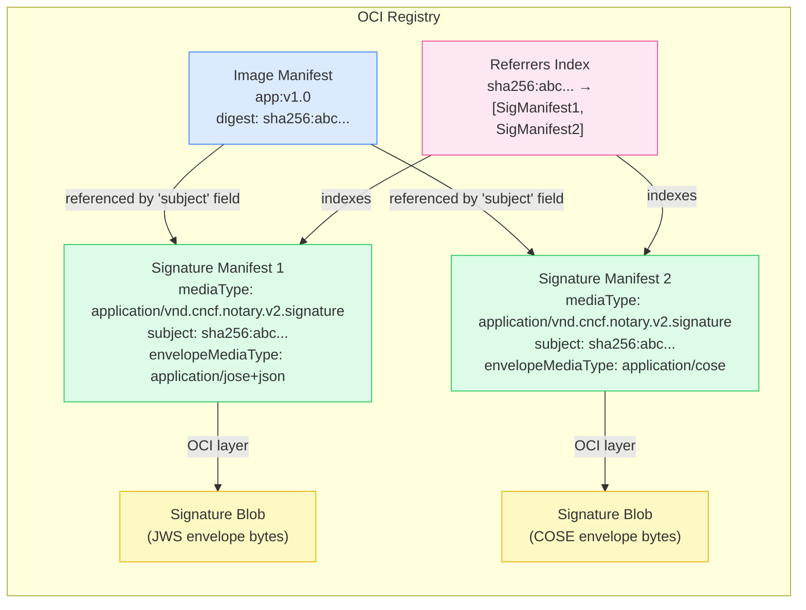
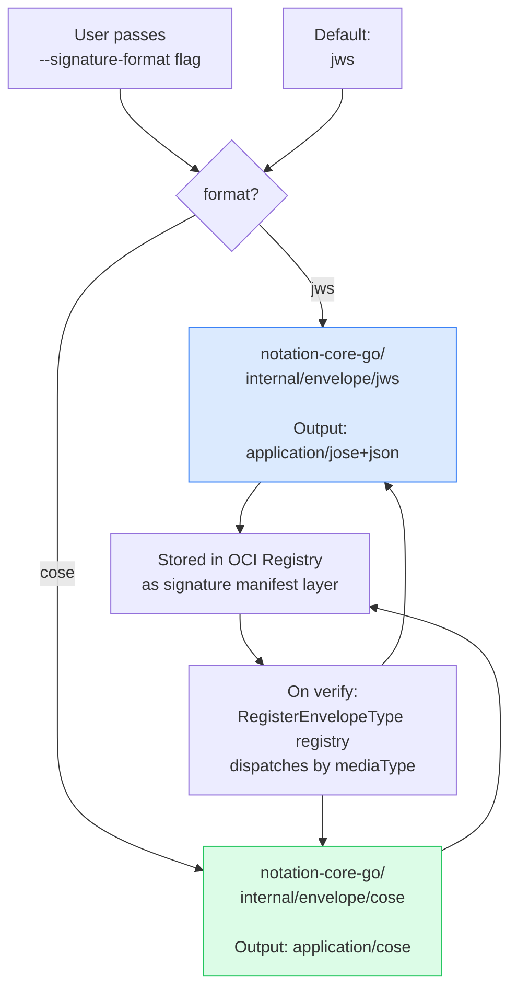

# Detailed Architecture Diagrams — Notation Project

**Generated**: 2026-03-12

All diagrams use [Mermaid](https://mermaid.js.org/) syntax and can be rendered in:
- GitHub Markdown (native support)
- VS Code with the Mermaid Preview extension
- Any Mermaid-compatible viewer at https://mermaid.live

---

## Diagram 1: Four-Tier Component Architecture



---

## Diagram 2: Signing Data Flow (Sequence)



---

## Diagram 3: Verification Data Flow (Sequence)



---

## Diagram 4: Plugin Architecture

```mermaid
graph LR
    subgraph Process1["notation Process (PID 1234)"]
        NOTATION[notation binary]
        PM[plugin.Manager]
        PR[plugin.Runner]
        STDIN_WRITE[JSON request\nstdin write]
        STDOUT_READ[JSON response\nstdout read]
    end

    subgraph Process2["Plugin Process (PID 5678)"]
        PLUGIN_EXE[notation-myplugin binary]
        DISPATCHER[plugin.Dispatch]
        HANDLER[SignPlugin / VerifyPlugin\nimplementation]
        KMS[Key Material\n(HSM / KMS / PKCS12)]
    end

    NOTATION -->|1. resolve plugin name| PM
    PM -->|2. locate binary in libexec dir| PR
    PR -->|3. os.exec.Start| PLUGIN_EXE
    PR --> STDIN_WRITE
    STDIN_WRITE -->|4. JSON SignatureRequest\nvia stdin| DISPATCHER
    DISPATCHER -->|5. dispatch by operation| HANDLER
    HANDLER <-->|6. access key material\n(never leaves plugin)| KMS
    HANDLER -->|7. return signature bytes| DISPATCHER
    DISPATCHER -->|8. JSON SignatureResponse\nvia stdout| STDOUT_READ
    STDOUT_READ -->|9. parse response| NOTATION

    style Process1 fill:#dbeafe,stroke:#3b82f6
    style Process2 fill:#dcfce7,stroke:#22c55e
    style KMS fill:#fce7f3,stroke:#ec4899
```

---

## Diagram 5: Trust Model and Configuration Layout



---

## Diagram 6: OCI Referrers Model (How Signatures Are Stored)



---

## Diagram 7: Envelope Package Selection (JWS vs COSE)


