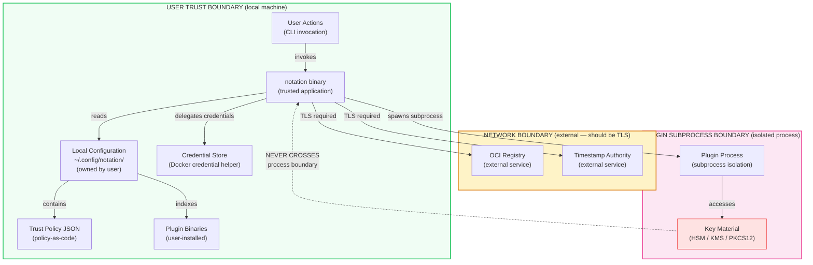
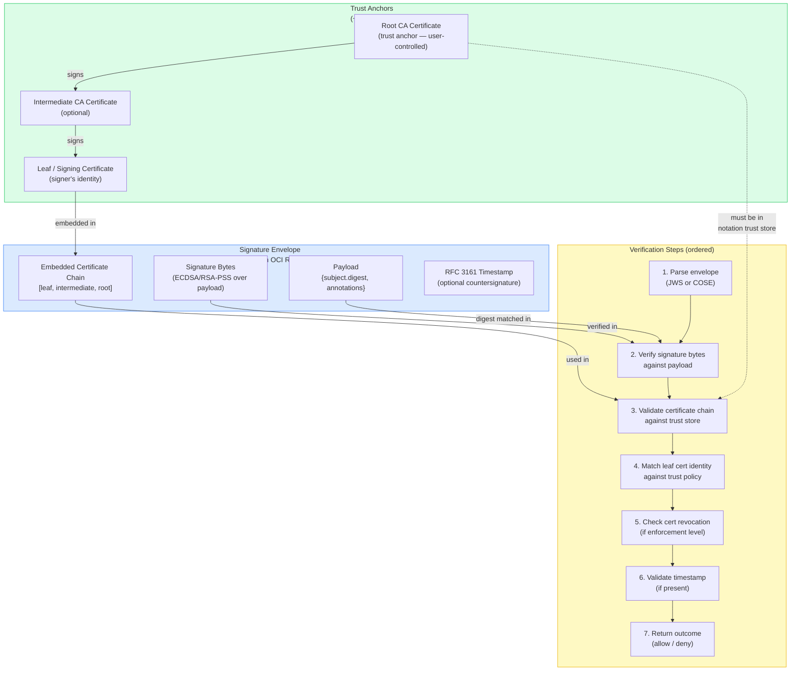
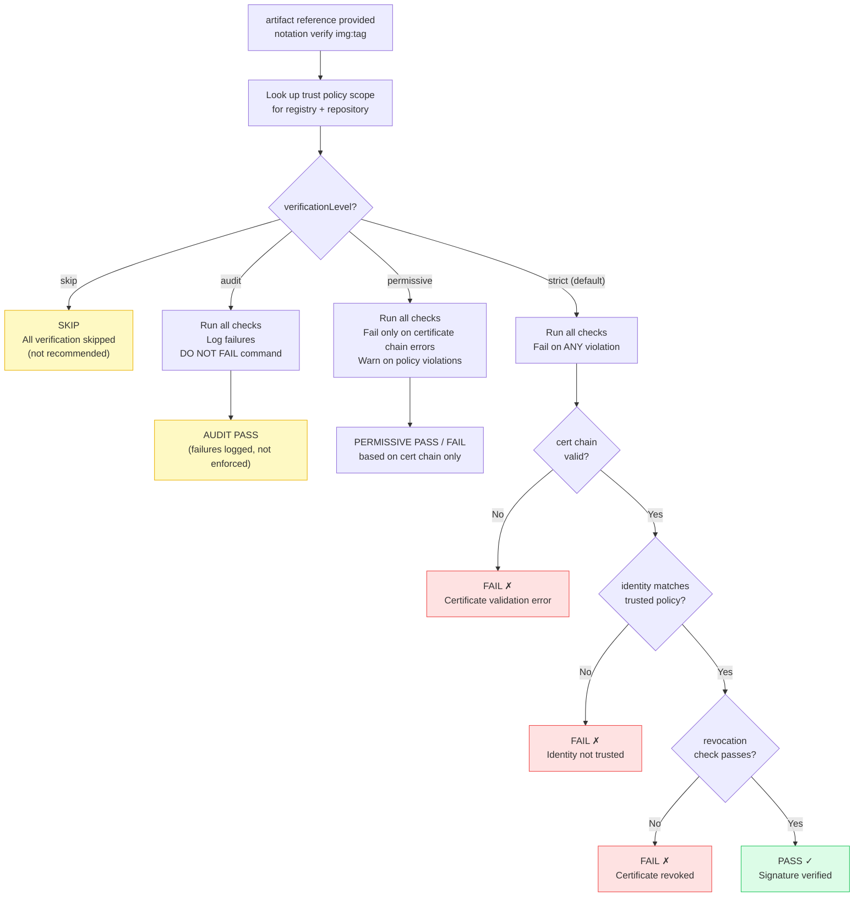
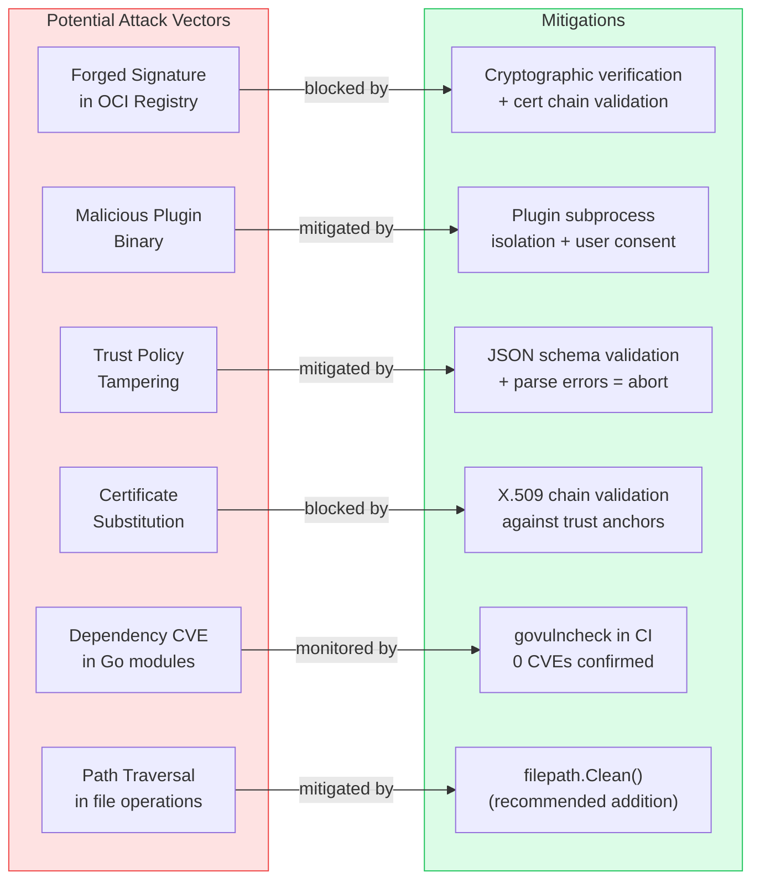

# Security Model Visual — Notation Project

**Generated**: 2026-03-12
All diagrams use Mermaid syntax.

---

## Diagram 1: Trust Boundary Map

---

## Diagram 2: Cryptographic Trust Chain

---

## Diagram 3: Verification Levels and Outcomes

---

## Diagram 4: Attack Surfaces and Mitigations

