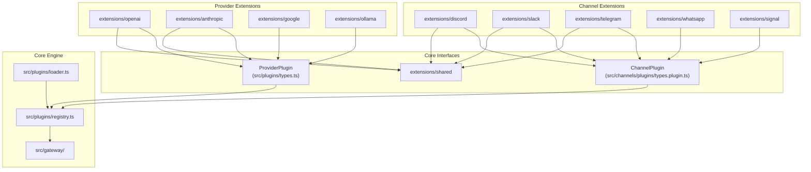
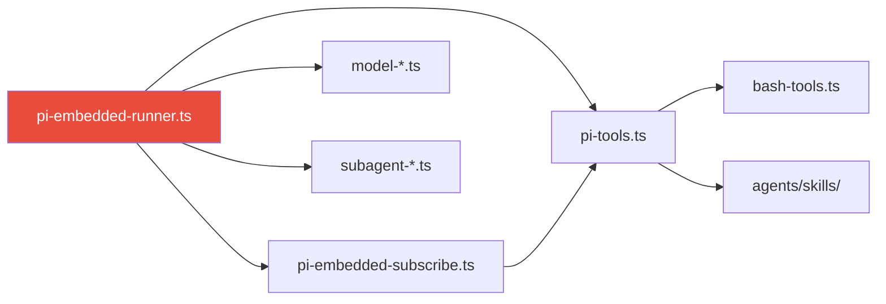
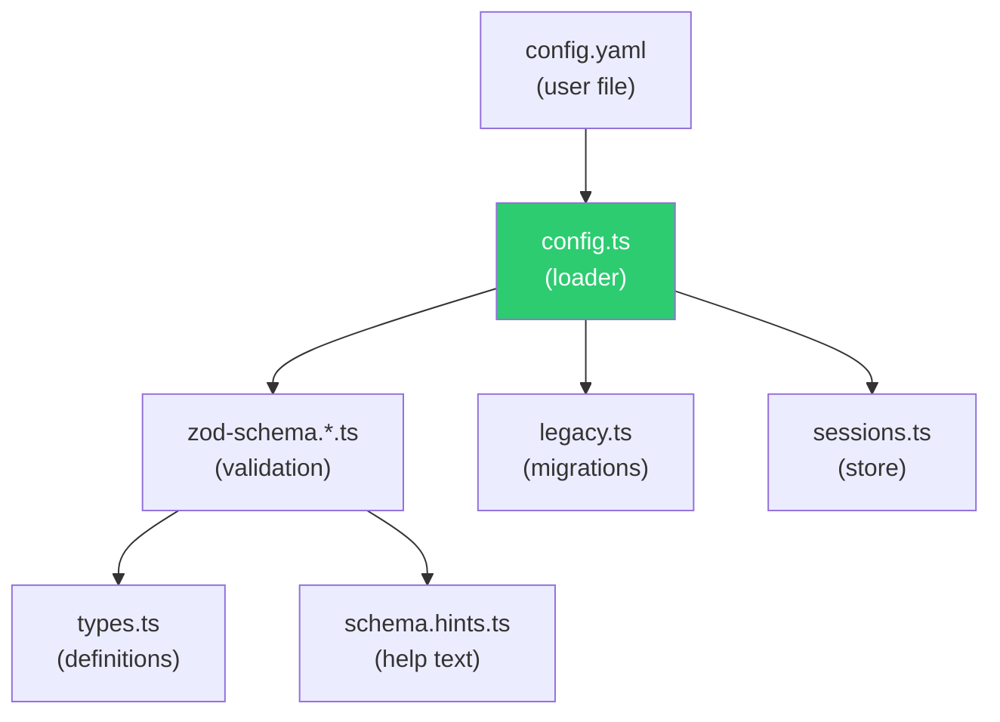
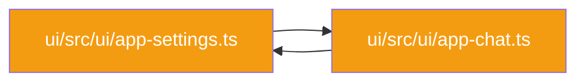

# Dependency Graphs — OpenClaw

**Date:** 2026-03-18

---

## 1. Extension → Core Dependency Map



---

## 2. Agent Execution Dependency Chain



---

## 3. Configuration Dependency Chain



---

## 4. Circular Dependencies

Only **1 circular dependency** was detected in the entire codebase:



**Impact:** Low — limited to the web UI layer. The settings and chat views reference each other, likely through shared state or navigation.

---

## 5. Dependency Statistics

| Metric | Value |
|--------|-------|
| Total files analyzed | 12,136 |
| Total dependency edges | 20,370 |
| Circular dependencies | 1 |
| Average deps per file | 1.7 |
| Max dependents (most-imported file) | See impact analysis |

---

## 6. Skill → Tool Dependency Map

```mermaid
graph TD
    subgraph "Skill Categories"
        S_Prod["Productivity Skills"]
        S_Dev["Development Skills"]
        S_Comm["Communication Skills"]
        S_Media["Media Skills"]
        S_Voice["Voice Skills"]
        S_Home["Smart Home Skills"]
    end

    subgraph "Core Tools"
        T_Browser["Browser Tool"]
        T_Shell["system.run"]
        T_Canvas["Canvas"]
        T_ImgGen["Image Generation"]
        T_Cron["Cron"]
        T_Memory["Memory"]
    end

    subgraph "Agent"
        Agent["Pi Agent Runtime"]
    end

    S_Prod --> Agent
    S_Dev --> Agent
    S_Comm --> Agent
    S_Media --> Agent
    S_Voice --> Agent
    S_Home --> Agent

    Agent --> T_Browser
    Agent --> T_Shell
    Agent --> T_Canvas
    Agent --> T_ImgGen
    Agent --> T_Cron
    Agent --> T_Memory
```
