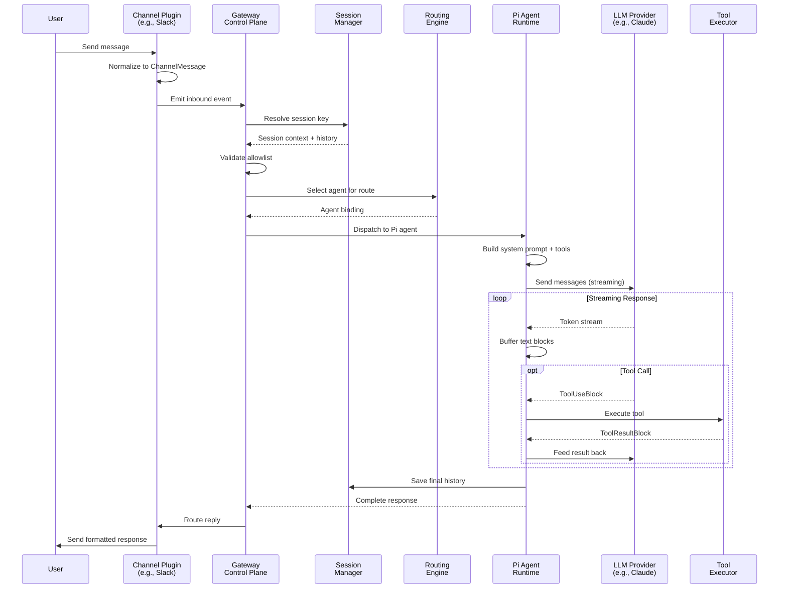
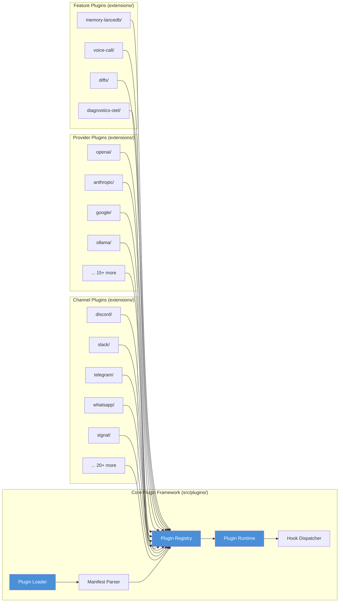
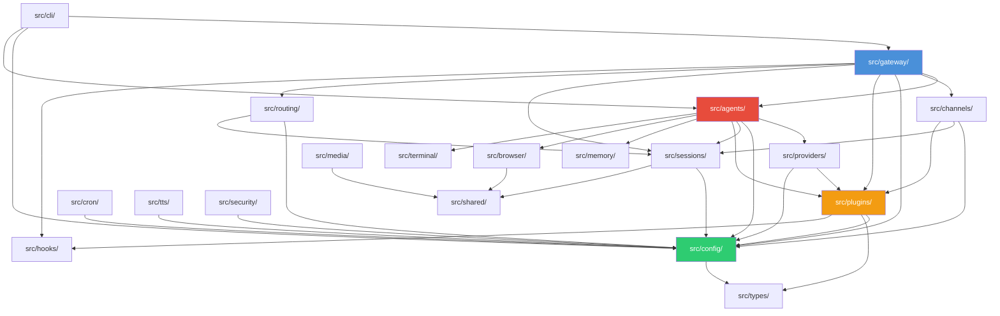
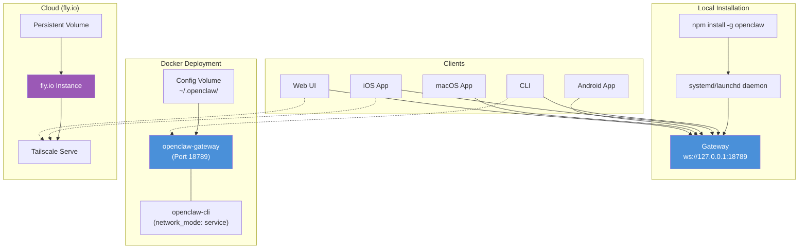
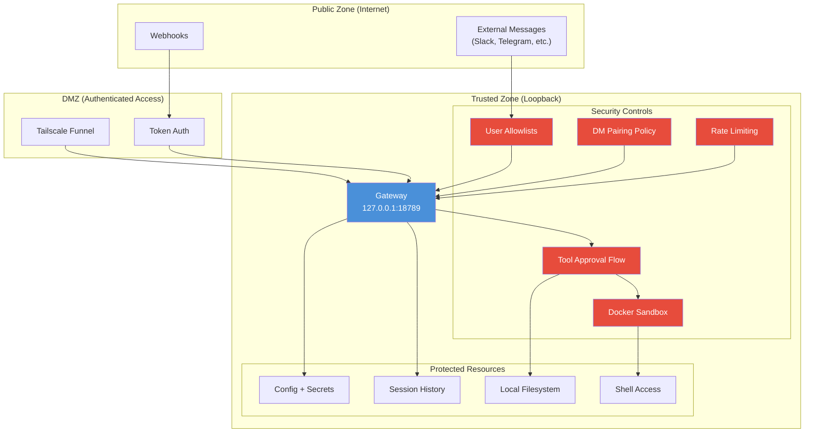

# Detailed Architecture Diagrams — OpenClaw

**Date:** 2026-03-18

---

## 1. High-Level System Architecture

```mermaid
graph TB
    subgraph "User Interfaces"
        CLI["CLI<br/>(openclaw.mjs)"]
        WebUI["Web Dashboard<br/>(ui/)"]
        iOS["iOS App<br/>(apps/ios/)"]
        macOS["macOS App<br/>(apps/macos/)"]
        Android["Android App<br/>(apps/android/)"]
    end

    subgraph "Messaging Channels"
        WA["WhatsApp"]
        TG["Telegram"]
        SL["Slack"]
        DC["Discord"]
        SIG["Signal"]
        iMsg["iMessage"]
        MTX["Matrix"]
        Teams["MS Teams"]
        IRC2["IRC"]
        MORE["... 16 more"]
    end

    subgraph "Gateway Control Plane"
        GW["WebSocket Server<br/>ws://127.0.0.1:18789"]
        Auth["Auth Module"]
        SM["Session Manager"]
        Router["Routing Engine"]
        ChanMgr["Channel Manager"]
        PlugMgr["Plugin Manager"]
        HookSys["Hook System"]
    end

    subgraph "Agent Runtime"
        Pi["Pi Agent Runner"]
        Tools["Tool Executor"]
        Skills["Skill Loader"]
        SubAgent["Sub-Agent Manager"]
        Stream["Stream Handler"]
    end

    subgraph "LLM Providers"
        Anthropic["Anthropic<br/>(Claude)"]
        OpenAI["OpenAI<br/>(GPT-4)"]
        Google["Google<br/>(Gemini)"]
        Ollama["Ollama<br/>(Local)"]
        Bedrock["AWS Bedrock"]
        MoreProv["... 15 more"]
    end

    subgraph "Storage"
        Config["Config<br/>(~/.openclaw/config.yaml)"]
        Sessions["Session Store<br/>(filesystem)"]
        Memory["Memory<br/>(LanceDB)"]
    end

    CLI --> GW
    WebUI --> GW
    iOS --> GW
    macOS --> GW
    Android --> GW

    WA --> ChanMgr
    TG --> ChanMgr
    SL --> ChanMgr
    DC --> ChanMgr
    SIG --> ChanMgr
    iMsg --> ChanMgr
    MTX --> ChanMgr
    Teams --> ChanMgr
    IRC2 --> ChanMgr
    MORE --> ChanMgr

    GW --> Auth
    GW --> SM
    GW --> Router
    GW --> ChanMgr
    GW --> PlugMgr
    GW --> HookSys

    Router --> Pi
    Pi --> Tools
    Pi --> Skills
    Pi --> SubAgent
    Pi --> Stream

    Pi --> Anthropic
    Pi --> OpenAI
    Pi --> Google
    Pi --> Ollama
    Pi --> Bedrock
    Pi --> MoreProv

    SM --> Sessions
    GW --> Config
    Pi --> Memory

    style GW fill:#4A90D9,color:#fff
    style Pi fill:#E74C3C,color:#fff
    style ChanMgr fill:#27AE60,color:#fff
    style PlugMgr fill:#F39C12,color:#fff
```

---

## 2. Message Flow Sequence

---

## 3. Plugin System Architecture

---

## 4. Core Module Dependencies

---

## 5. Deployment Architecture

---

## 6. Security Architecture

