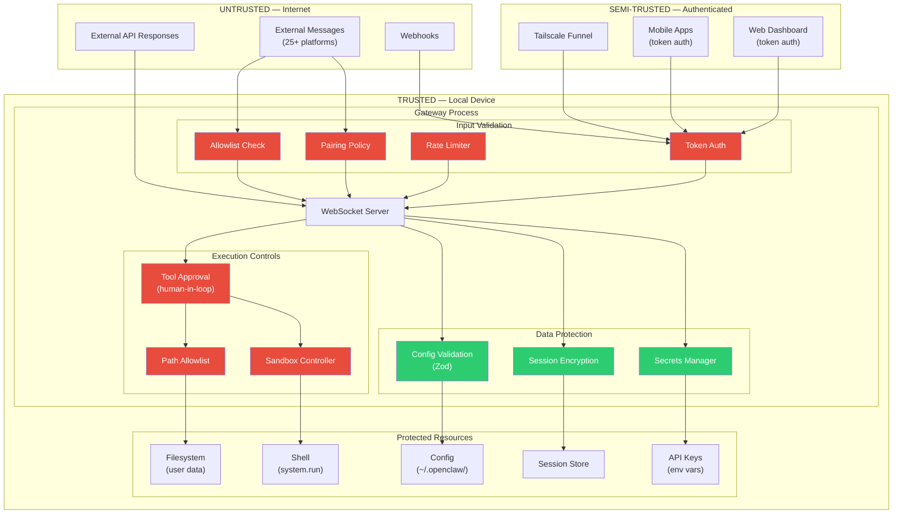
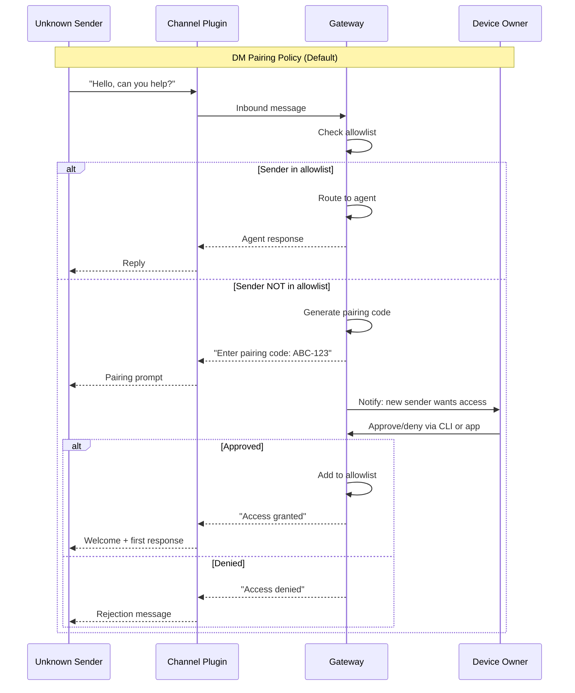
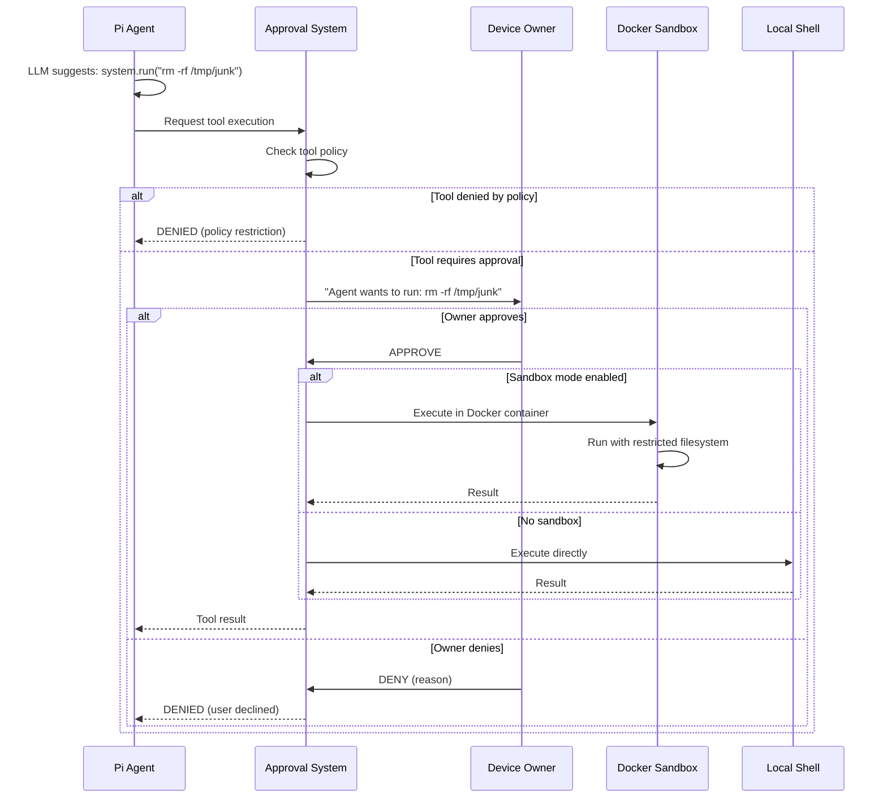
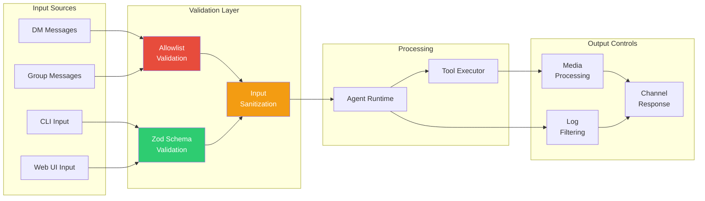

# Security Model Diagram — OpenClaw

**Date:** 2026-03-18

---

## Trust Boundary Model

```mermaid
graph TB
    subgraph "UNTRUSTED — Internet"
        EM["External Messages<br/>(25+ platforms)"]
        WH["Webhooks"]
        API_Ext["External API Responses"]
    end

    subgraph "SEMI-TRUSTED — Authenticated"
        TS["Tailscale Funnel"]
        MobileApps["Mobile Apps<br/>(token auth)"]
        WebUI2["Web Dashboard<br/>(token auth)"]
    end

    subgraph "TRUSTED — Local Device"
        subgraph "Gateway Process"
            GW2["WebSocket Server"]
            
            subgraph "Input Validation"
                AL["Allowlist Check"]
                PP["Pairing Policy"]
                RL["Rate Limiter"]
                TA["Token Auth"]
            end

            subgraph "Execution Controls"
                ToolAppr["Tool Approval<br/>(human-in-loop)"]
                SandboxCtrl["Sandbox Controller"]
                PathPolicy["Path Allowlist"]
            end

            subgraph "Data Protection"
                SecretsMgr["Secrets Manager"]
                SessionEnc["Session Encryption"]
                ConfigVal["Config Validation<br/>(Zod)"]
            end
        end

        subgraph "Protected Resources"
            FS["Filesystem<br/>(user data)"]
            Shell2["Shell<br/>(system.run)"]
            ConfigFile["Config<br/>(~/.openclaw/)"]
            SessionStore["Session Store"]
            APIKeys["API Keys<br/>(env vars)"]
        end
    end

    EM --> AL
    EM --> PP
    WH --> TA
    API_Ext --> GW2

    TS --> TA
    MobileApps --> TA
    WebUI2 --> TA

    AL --> GW2
    PP --> GW2
    RL --> GW2
    TA --> GW2

    GW2 --> ToolAppr
    ToolAppr --> SandboxCtrl
    SandboxCtrl --> Shell2
    ToolAppr --> PathPolicy
    PathPolicy --> FS

    GW2 --> SecretsMgr
    SecretsMgr --> APIKeys
    GW2 --> SessionEnc
    SessionEnc --> SessionStore
    GW2 --> ConfigVal
    ConfigVal --> ConfigFile

    style AL fill:#E74C3C,color:#fff
    style PP fill:#E74C3C,color:#fff
    style RL fill:#E74C3C,color:#fff
    style TA fill:#E74C3C,color:#fff
    style ToolAppr fill:#E74C3C,color:#fff
    style SandboxCtrl fill:#E74C3C,color:#fff
    style PathPolicy fill:#E74C3C,color:#fff
    style SecretsMgr fill:#2ECC71,color:#fff
    style SessionEnc fill:#2ECC71,color:#fff
    style ConfigVal fill:#2ECC71,color:#fff
```

---

## Authentication Flow

```mermaid
sequenceDiagram
    participant Sender as Unknown Sender
    participant Channel as Channel Plugin
    participant GW as Gateway
    participant Owner as Device Owner

    Note over Sender,Owner: DM Pairing Policy (Default)
    
    Sender->>Channel: "Hello, can you help?"
    Channel->>GW: Inbound message
    GW->>GW: Check allowlist
    
    alt Sender in allowlist
        GW->>GW: Route to agent
        GW-->>Channel: Agent response
        Channel-->>Sender: Reply
    else Sender NOT in allowlist
        GW->>GW: Generate pairing code
        GW-->>Channel: "Enter pairing code: ABC-123"
        Channel-->>Sender: Pairing prompt
        GW->>Owner: Notify: new sender wants access
        Owner->>GW: Approve/deny via CLI or app
        
        alt Approved
            GW->>GW: Add to allowlist
            GW-->>Channel: "Access granted"
            Channel-->>Sender: Welcome + first response
        else Denied
            GW-->>Channel: "Access denied"
            Channel-->>Sender: Rejection message
        end
    end
```

---

## Tool Execution Security Flow

```mermaid
sequenceDiagram
    participant Agent as Pi Agent
    participant Approval as Approval System
    participant Owner as Device Owner
    participant Sandbox as Docker Sandbox
    participant Shell as Local Shell

    Agent->>Agent: LLM suggests: system.run("rm -rf /tmp/junk")
    Agent->>Approval: Request tool execution
    Approval->>Approval: Check tool policy
    
    alt Tool denied by policy
        Approval-->>Agent: DENIED (policy restriction)
    else Tool requires approval
        Approval->>Owner: "Agent wants to run: rm -rf /tmp/junk"
        
        alt Owner approves
            Owner->>Approval: APPROVE
            
            alt Sandbox mode enabled
                Approval->>Sandbox: Execute in Docker container
                Sandbox->>Sandbox: Run with restricted filesystem
                Sandbox-->>Approval: Result
            else No sandbox
                Approval->>Shell: Execute directly
                Shell-->>Approval: Result
            end
            
            Approval-->>Agent: Tool result
        else Owner denies
            Owner->>Approval: DENY (reason)
            Approval-->>Agent: DENIED (user declined)
        end
    end
```

---

## Data Flow Security Controls

```mermaid
graph LR
    subgraph "Input Sources"
        DM["DM Messages"]
        Group["Group Messages"]
        CLI3["CLI Input"]
        Web["Web UI Input"]
    end

    subgraph "Validation Layer"
        ZodV["Zod Schema<br/>Validation"]
        AllowV["Allowlist<br/>Validation"]
        SanitizeV["Input<br/>Sanitization"]
    end

    subgraph "Processing"
        Agent2["Agent Runtime"]
        ToolExec["Tool Executor"]
    end

    subgraph "Output Controls"
        MediaProc["Media<br/>Processing"]
        LogFilter["Log<br/>Filtering"]
        Response["Channel<br/>Response"]
    end

    DM --> AllowV
    Group --> AllowV
    CLI3 --> ZodV
    Web --> ZodV

    AllowV --> SanitizeV
    ZodV --> SanitizeV
    SanitizeV --> Agent2
    Agent2 --> ToolExec

    ToolExec --> MediaProc
    Agent2 --> LogFilter
    MediaProc --> Response
    LogFilter --> Response

    style ZodV fill:#2ECC71,color:#fff
    style AllowV fill:#E74C3C,color:#fff
    style SanitizeV fill:#F39C12,color:#fff
```
