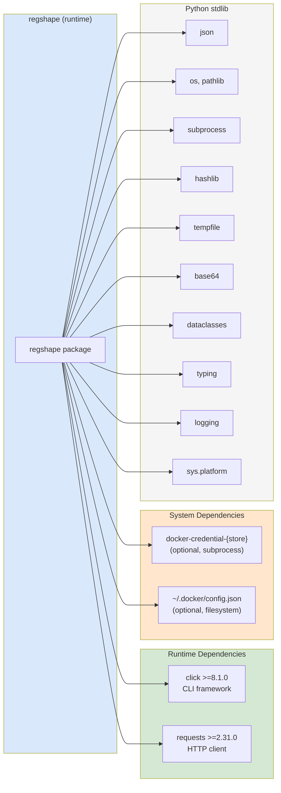
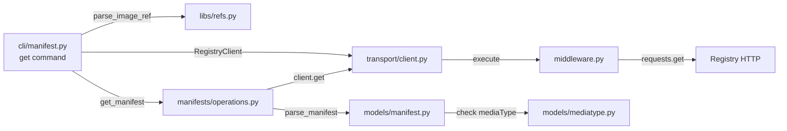

# regshape — Dependency Graphs

**Project:** regshape v0.1.0  
**Analysis Date:** 2026-03-08  

---

## 1. Import Dependency Graph (Library Layer)

```mermaid
graph TB
    subgraph CLI["CLI Layer"]
        cli_main["cli/main.py"]
        cli_auth["cli/auth.py"]
        cli_blob["cli/blob.py"]
        cli_catalog["cli/catalog.py"]
        cli_layout["cli/layout.py"]
        cli_manifest["cli/manifest.py"]
        cli_referrer["cli/referrer.py"]
        cli_tag["cli/tag.py"]
    end

    subgraph Transport["Transport Layer"]
        t_client["transport/client.py<br/>RegistryClient"]
        t_mw["transport/middleware.py<br/>MiddlewarePipeline"]
        t_models["transport/models.py<br/>RegistryRequest/Response"]
    end

    subgraph AuthLayer["Auth Layer"]
        a_creds["auth/credentials.py"]
        a_dcfg["auth/dockerconfig.py"]
        a_dcs["auth/dockercredstore.py"]
        a_reg["auth/registryauth.py"]
    end

    subgraph OpsLayer["Operations Layer"]
        o_blobs["blobs/operations.py"]
        o_manifests["manifests/operations.py"]
        o_tags["tags/operations.py"]
        o_catalog["catalog/operations.py"]
        o_referrers["referrers/operations.py"]
        o_layout["layout/operations.py"]
    end

    subgraph ModelsLayer["Models Layer"]
        m_manifest["models/manifest.py"]
        m_descriptor["models/descriptor.py"]
        m_mediatype["models/mediatype.py"]
        m_blob["models/blob.py"]
        m_catalog["models/catalog.py"]
        m_tags["models/tags.py"]
        m_referrer["models/referrer.py"]
        m_error["models/error.py"]
    end

    subgraph DecsLayer["Decorators Layer"]
        d_timing["decorators/timing.py"]
        d_scenario["decorators/scenario.py"]
        d_output["decorators/output.py"]
        d_metrics["decorators/metrics.py"]
        d_sanitize["decorators/sanitization.py"]
        d_calls["decorators/call_details.py"]
    end

    subgraph Utils["Utilities"]
        refs["libs/refs.py"]
        errors_mod["libs/errors.py"]
        constants["libs/constants.py"]
    end

    %% CLI → Transport
    cli_auth --> t_client
    cli_blob --> t_client
    cli_manifest --> t_client
    cli_catalog --> t_client
    cli_referrer --> t_client
    cli_tag --> t_client
    cli_layout --> t_client

    %% CLI → Operations
    cli_blob --> o_blobs
    cli_manifest --> o_manifests
    cli_catalog --> o_catalog
    cli_referrer --> o_referrers
    cli_tag --> o_tags
    cli_layout --> o_layout
    cli_auth --> a_creds

    %% CLI → Utils
    cli_auth --> refs
    cli_blob --> refs
    cli_manifest --> refs
    cli_catalog --> refs

    %% Transport internal
    t_client --> t_mw
    t_client --> t_models
    t_client --> a_creds
    t_mw --> a_reg
    t_mw --> d_sanitize
    t_mw --> d_calls

    %% Auth internal
    a_creds --> a_dcfg
    a_creds --> a_dcs
    a_dcfg --> constants

    %% Operations → Transport
    o_blobs --> t_client
    o_manifests --> t_client
    o_tags --> t_client
    o_catalog --> t_client
    o_referrers --> t_client
    o_layout --> t_client

    %% Operations → Models
    o_blobs --> m_descriptor
    o_blobs --> m_blob
    o_manifests --> m_manifest
    o_manifests --> m_mediatype
    o_tags --> m_tags
    o_tags --> m_error
    o_catalog --> m_catalog
    o_catalog --> m_error
    o_referrers --> m_manifest
    o_referrers --> m_referrer
    o_layout --> m_manifest
    o_layout --> m_descriptor

    %% Operations → Decorators
    o_blobs --> d_timing
    o_blobs --> d_scenario
    o_manifests --> d_timing
    o_tags --> d_timing
    o_catalog --> d_timing
    o_referrers --> d_timing
    o_layout --> d_timing

    %% Operations → Errors
    o_blobs --> errors_mod
    o_manifests --> errors_mod
    o_tags --> errors_mod
    o_catalog --> errors_mod
    o_referrers --> errors_mod
    o_layout --> errors_mod

    %% Models internal
    m_manifest --> m_mediatype
    m_manifest --> m_descriptor
    m_referrer --> m_manifest

    %% Decorators internal
    d_scenario --> d_output
    d_scenario --> d_timing
    d_calls --> d_sanitize

    style CLI fill:#dae8fc
    style Transport fill:#d5e8d4
    style AuthLayer fill:#ffe6cc
    style OpsLayer fill:#fff2cc
    style ModelsLayer fill:#f8cecc
    style DecsLayer fill:#e1d5e7
    style Utils fill:#f5f5f5
```



---

## 2. External Dependencies



---

## 3. Call Graph: Common Operations

### manifest get



### blob push

```mermaid
graph LR
    CLI_B["cli/blob.py<br/>push command"] --> |compute sha256| HASH["hashlib"]
    CLI_B --> |push_blob_monolithic| OPS_B["blobs/operations.py"]
    OPS_B --> |head_blob| OPS_B
    OPS_B --> |client.post upload URL| T_C["transport/client.py"]
    OPS_B --> |client.put blob data| T_C
    T_C --> REGISTRY["Registry HTTP"]
    OPS_B --> |@track_time| D_T["decorators/timing.py"]
    OPS_B --> |@track_scenario| D_S["decorators/scenario.py"]
```

---

## 4. Layer Coupling Matrix

| From → To | Transport | Auth | Operations | Models | Decorators | Utils |
|---|---|---|---|---|---|---|
| **CLI** | ✓ | ✓ | ✓ | — | — | ✓ |
| **Transport** | *(internal)* | ✓ | — | ✓ | ✓ | — |
| **Auth** | — | *(internal)* | — | — | — | ✓ |
| **Operations** | ✓ | — | — | ✓ | ✓ | ✓ |
| **Models** | — | — | — | *(internal)* | — | — |
| **Decorators** | — | — | — | — | *(internal)* | — |

**No circular dependencies detected.**  
The dependency graph is a strict DAG (directed acyclic graph).  
Layer ordering (most depended upon → least): Utils/Models → Decorators → Auth → Transport → Operations → CLI

---

## 5. Fan-In / Fan-Out Analysis

### High Fan-In (most imported) — Core modules

| Module | Imported By | Significance |
|---|---|---|
| `libs/errors.py` | All operations + CLI | Central exception hierarchy |
| `libs/models/descriptor.py` | manifests, blobs, layout | Core OCI primitive |
| `libs/models/mediatype.py` | manifests, referrers, layout | OCI media type constants |
| `libs/transport/client.py` | All CLI modules + all operations | Only HTTP gateway |
| `libs/decorators/timing.py` | All operations | Universal telemetry |
| `libs/refs.py` | All CLI modules | Image reference parsing |

### High Fan-Out (imports most) — Complex modules

| Module | Imports Count | Notes |
|---|---|---|
| `libs/blobs/operations.py` | Many | Transport + 3 models + 2 decorators + errors |
| `libs/transport/client.py` | Many | Middleware + models + auth |
| `cli/blob.py` | Many | Refs + ops + transport + models |
