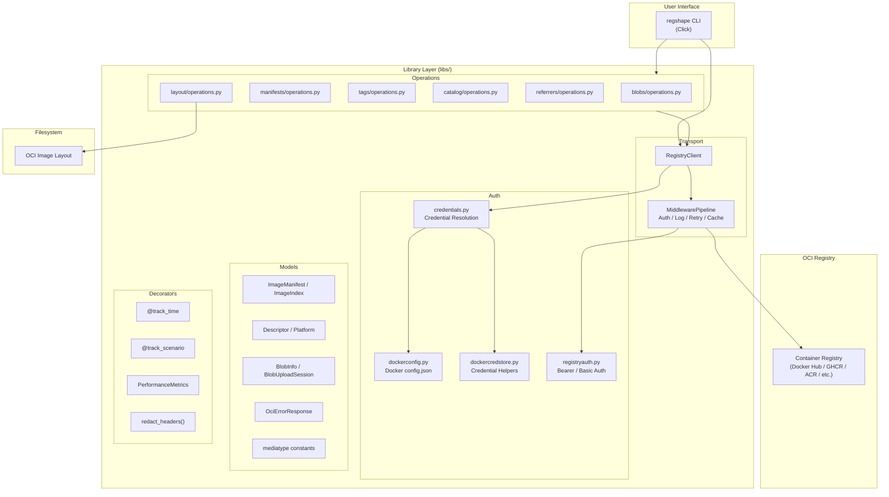
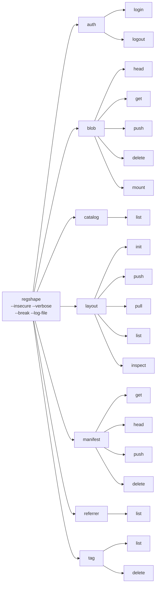
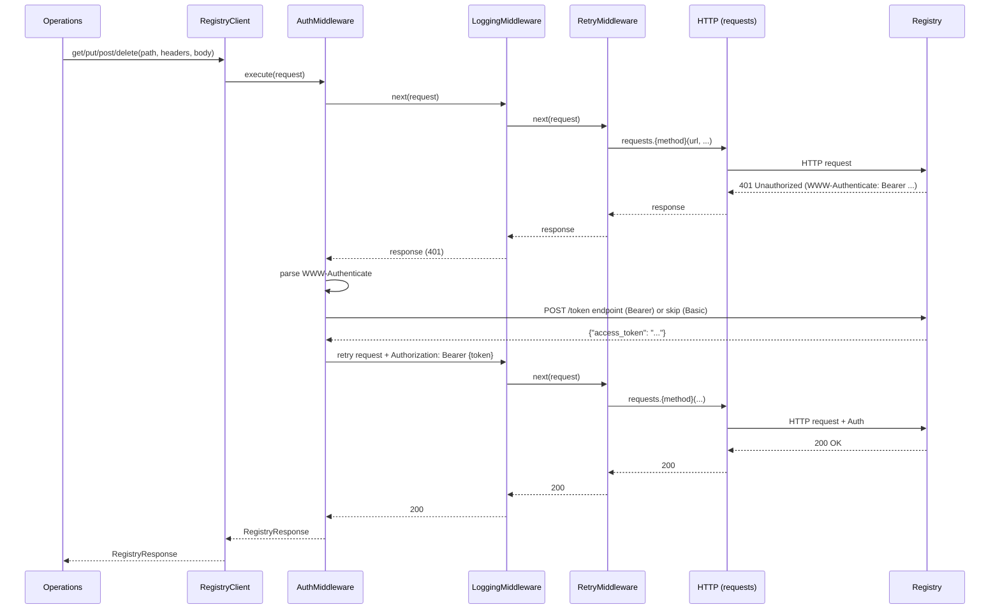
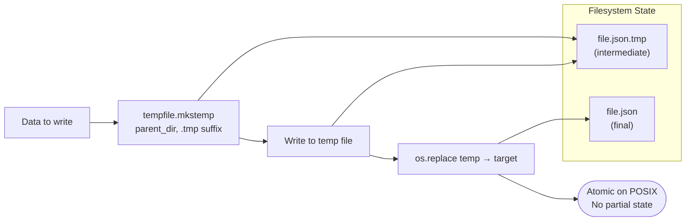
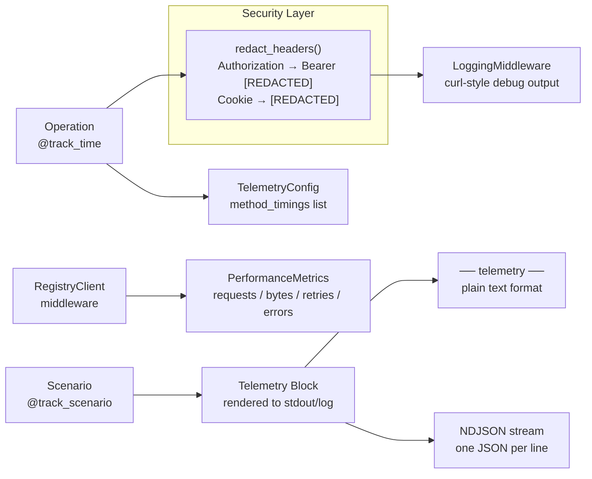
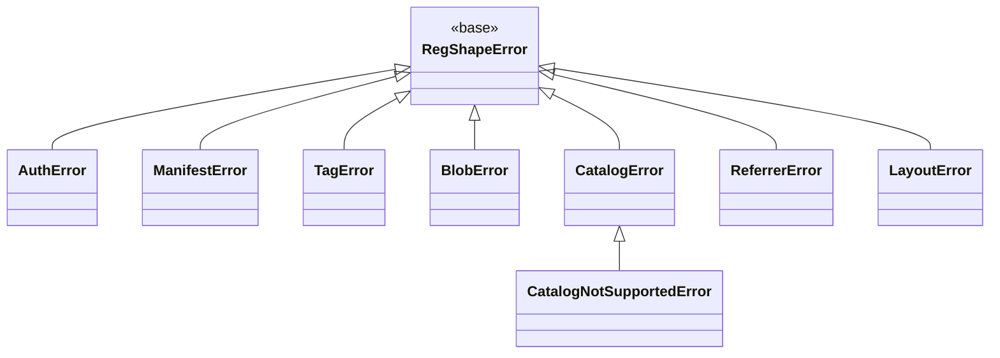
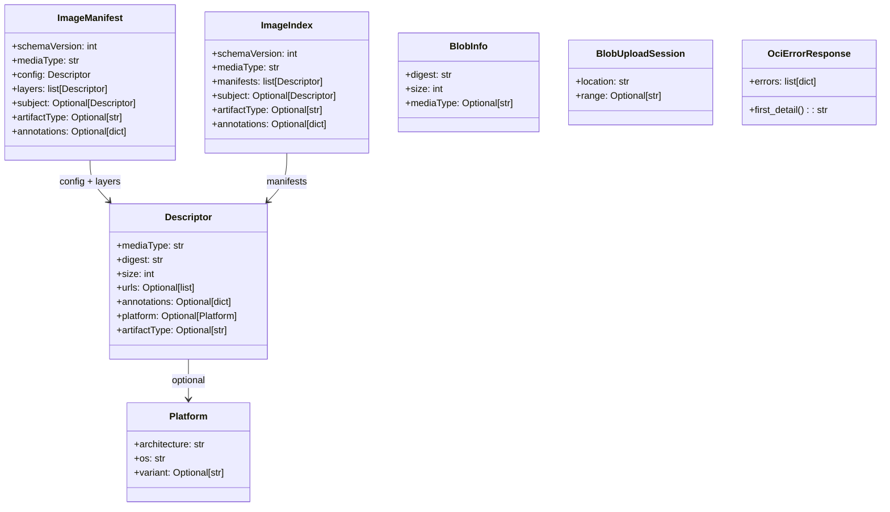

# regshape — Mermaid Architecture Diagrams

**Project:** regshape v0.1.0  
**Analysis Date:** 2026-03-08  

---

## 1. High-Level System Architecture



---

## 2. CLI Command Hierarchy



---

## 3. Middleware Pipeline



---

## 4. Authentication Flow

```mermaid
flowchart TD
    START([Request needs auth]) --> CHECK_401{Response is 401?}
    CHECK_401 -- No --> SUCCESS([Return response])
    CHECK_401 -- Yes --> PARSE_WWW[Parse WWW-Authenticate header]
    
    PARSE_WWW --> BEARER{Bearer scheme?}
    BEARER -- Yes --> RESOLVE_CREDS[Resolve credentials]
    BEARER -- No --> BASIC[Build Basic auth header<br/>Base64 user:pass]
    
    RESOLVE_CREDS --> CRED_CHAIN{Credential priority chain}
    CRED_CHAIN --> EXPLICIT[1. Explicit --username/--password]
    CRED_CHAIN --> CRED_HELPER[2. credHelpers in docker config]
    CRED_CHAIN --> DOCKER_AUTHS[3. auths in docker config]
    CRED_CHAIN --> ANON[4. Anonymous]
    
    EXPLICIT --> TOKEN_EP[POST token endpoint<br/>with credentials]
    CRED_HELPER --> HELPER_PROC[Exec docker-credential-{store}<br/>subprocess]
    HELPER_PROC --> TOKEN_EP
    DOCKER_AUTHS --> DECODE[Decode Base64 user:pass] 
    DECODE --> TOKEN_EP
    ANON --> TOKEN_EP
    
    TOKEN_EP --> GOT_TOKEN{Token received?}
    GOT_TOKEN -- Yes --> RETRY[Retry with Authorization: Bearer {token}]
    GOT_TOKEN -- No --> BASIC
    
    BASIC --> RETRY
    RETRY --> SUCCESS
```

---

## 5. Blob Push Flow

```mermaid
flowchart TD
    START([push_blob called]) --> HEAD[HEAD /v2/repo/blobs/digest<br/>Check if blob exists]
    HEAD --> EXISTS{200 OK?}
    EXISTS -- Yes --> SKIP([Skip — blob already exists<br/>Return existing Descriptor])
    EXISTS -- No --> MONO{Monolithic or Chunked?}
    
    MONO -- Monolithic --> POST[POST /v2/repo/blobs/uploads/<br/>Initiate upload → 202]
    POST --> EXTRACT[Extract Location header<br/>= upload URL]
    EXTRACT --> PUT[PUT {upload_url}?digest={digest}<br/>with full blob body]
    PUT --> CHECK{201 Created?}
    CHECK -- Yes --> RETURN([Return Descriptor<br/>mediaType, digest, size])
    CHECK -- No --> ERR([Raise BlobError])

    MONO -- Chunked --> POST2[POST /v2/repo/blobs/uploads/<br/>Initiate → 202]
    POST2 --> CHUNKS[For each chunk:<br/>PATCH {upload_url} with bytes<br/>Update Range header]
    CHUNKS --> FINAL_PUT[PUT {upload_url}?digest={digest}<br/>Finalize upload]
    FINAL_PUT --> RETURN
```

---

## 6. OCI Image Layout Write (Atomic)



---

## 7. Module Dependency Graph

```mermaid
graph TB
    subgraph CLI
        main_cli["cli/main.py"]
        auth_cli["cli/auth.py"]
        blob_cli["cli/blob.py"]
        cat_cli["cli/catalog.py"]
        layout_cli["cli/layout.py"]
        manifest_cli["cli/manifest.py"]
        referrer_cli["cli/referrer.py"]
        tag_cli["cli/tag.py"]
    end

    subgraph CoreLibs["Core Libraries"]
        transport_client["libs/transport/client.py"]
        transport_mw["libs/transport/middleware.py"]
        auth_creds["libs/auth/credentials.py"]
        auth_reg["libs/auth/registryauth.py"]
        refs["libs/refs.py"]
        errors["libs/errors.py"]
    end

    subgraph OpsLibs["Operations"]
        ops_blobs["libs/blobs/operations.py"]
        ops_manifests["libs/manifests/operations.py"]
        ops_tags["libs/tags/operations.py"]
        ops_catalog["libs/catalog/operations.py"]
        ops_referrers["libs/referrers/operations.py"]
        ops_layout["libs/layout/operations.py"]
    end

    subgraph ModelLibs["Models"]
        models_manifest["libs/models/manifest.py"]
        models_descriptor["libs/models/descriptor.py"]
        models_mediatype["libs/models/mediatype.py"]
        models_error["libs/models/error.py"]
    end

    subgraph DecLibs["Decorators"]
        dec_timing["libs/decorators/timing.py"]
        dec_scenario["libs/decorators/scenario.py"]
        dec_sanitization["libs/decorators/sanitization.py"]
    end

    auth_cli --> auth_creds
    blob_cli --> ops_blobs
    cat_cli --> ops_catalog
    layout_cli --> ops_layout
    manifest_cli --> ops_manifests
    referrer_cli --> ops_referrers
    tag_cli --> ops_tags

    auth_cli --> transport_client
    blob_cli --> transport_client
    manifest_cli --> transport_client

    transport_client --> transport_mw
    transport_client --> auth_creds
    transport_mw --> auth_reg
    transport_mw --> dec_sanitization

    auth_creds --> auth_reg

    ops_blobs --> models_descriptor
    ops_manifests --> models_manifest
    ops_manifests --> models_mediatype
    ops_tags --> models_error
    ops_catalog --> models_error
    ops_referrers --> models_manifest

    ops_blobs --> dec_timing
    ops_blobs --> dec_scenario
    ops_manifests --> dec_timing
    ops_tags --> dec_timing
    ops_catalog --> dec_timing
    ops_referrers --> dec_timing
    ops_layout --> dec_timing

    models_manifest --> models_mediatype
    models_manifest --> models_descriptor
```



---

## 8. Telemetry and Observability Model



---

## 9. Error Hierarchy



---

## 10. Data Model


