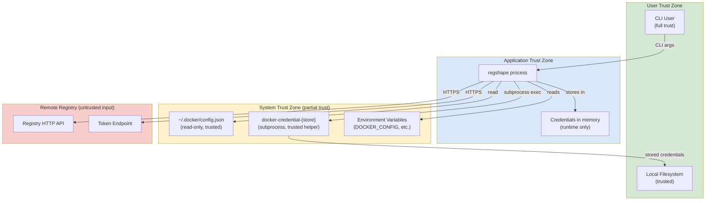
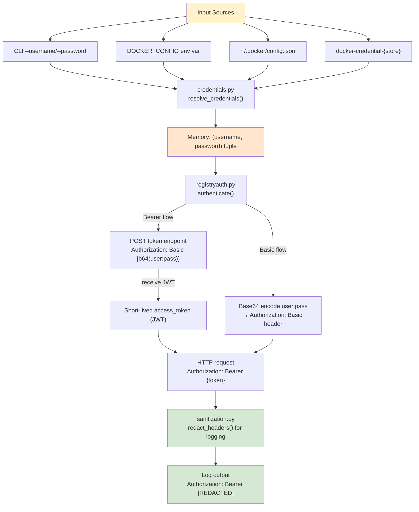
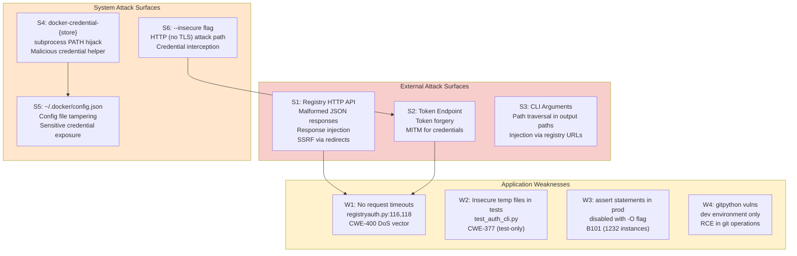
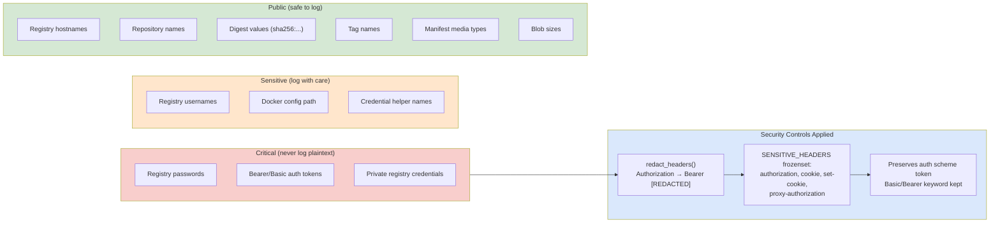
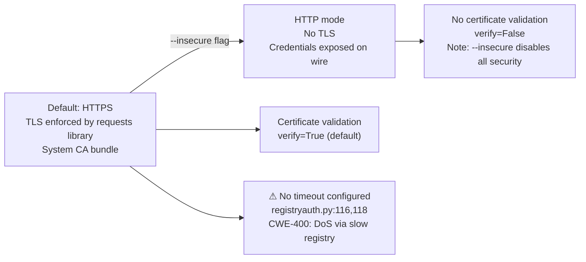
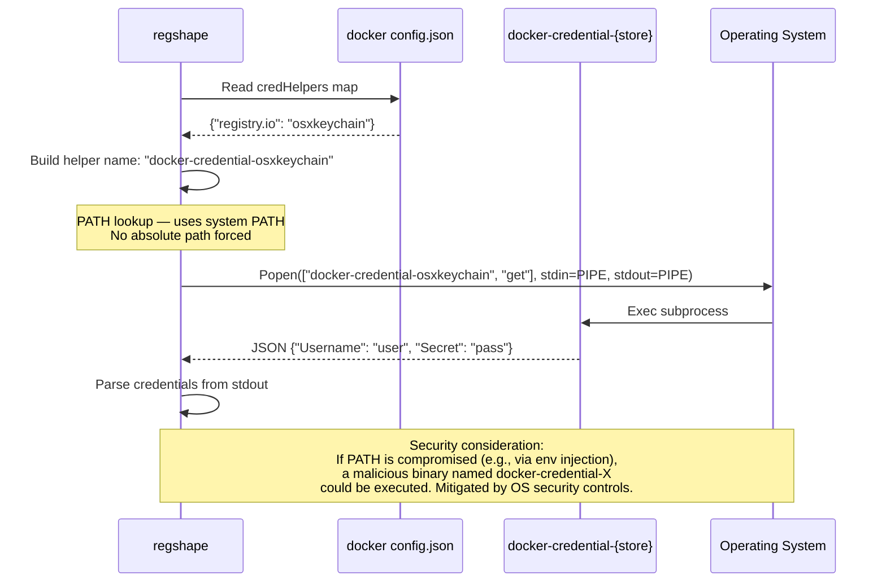

# regshape — Security Model Visualization

**Project:** regshape v0.1.0  
**Analysis Date:** 2026-03-08  

---

## 1. Trust Boundaries

---

## 2. Credential Flow and Security Controls

---

## 3. Attack Surface Map

---

## 4. Data Sensitivity Classification

---

## 5. TLS and Transport Security

---

## 6. Subprocess Security Model (Credential Helpers)

